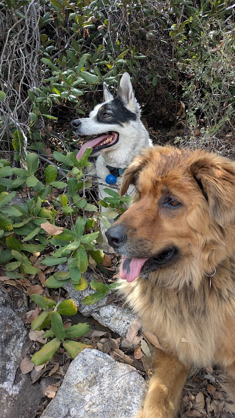
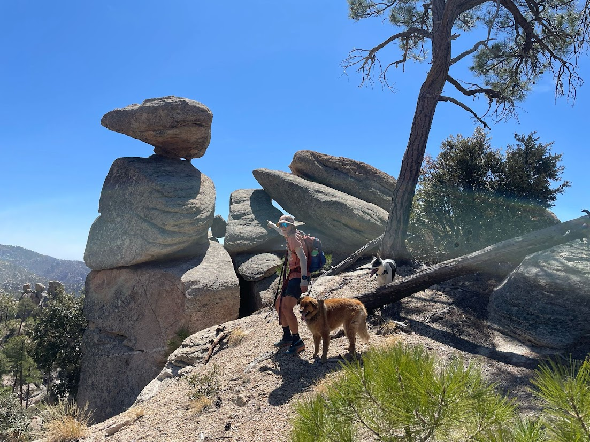

------------------------------------------------------------------------

I am an ecologist turned data scientist, or at least that is my ultimate dream. I currently work for the University of Arizona on a data collection application and spend most of my time developing R and Python applications for interactive data visualizations. I am currently finishing up my masters in Data Science.

I started my career collecting ecological data (small mammal trapping, electro-fishing, plant diversity, ect.) with the National Ecological Observatory Network and started to teach myself to code there for fun. Eventually I moved into data applications and began to learn more and more, and creating more (which you can check out on my other pages here).

I also love the desert, hiking/running and spending time with my loved ones...

::: {style="
[{style="border: 4px solid #D6A775; border-radius: 10px; box-shadow: 2px 2px 10px rgba(0,0,0,0.15);" fig-align="center" width="600"}](https://www.instagram.com/timbogilbert/?hl=en)
:::

------------------------------------------------------------------------

## Ultra Running Snap Shot

[{style="border: 4px solid #D6A775; border-radius: 10px; box-shadow: 2px 2px 10px rgba(0,0,0,0.15);" fig-align="center" width="600"}](https://ultrasignup.com/results_participant.aspx?fname=Timothy&lname=Gilbert#)

------------------------------------------------------------------------

## Contacts

*📧 [tsgilbert\@arizona.edu](mailto:tsgilbert@arizona.edu)*\
*💾 [GitHub](https://github.com/tgilbert14)*

------------------------------------------------------------------------

[{style="border: 4px solid #D6A775; border-radius: 10px; box-shadow: 2px 2px 10px rgba(0,0,0,0.15);" fig-align="center" width="600"}](https://www.linkedin.com/in/tgilbert14/)

