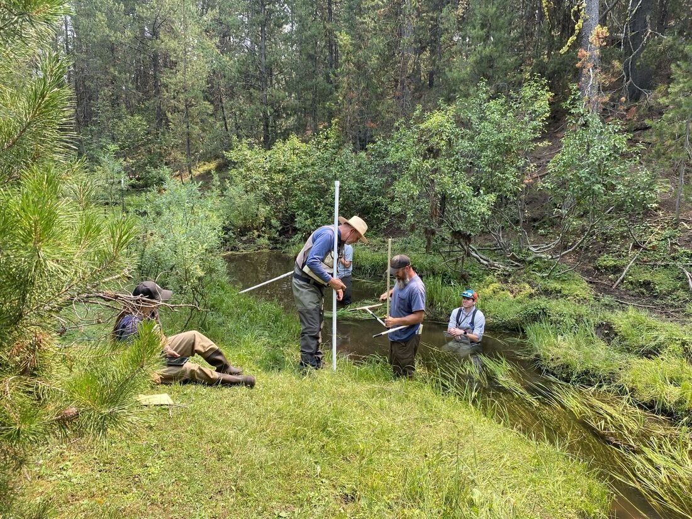
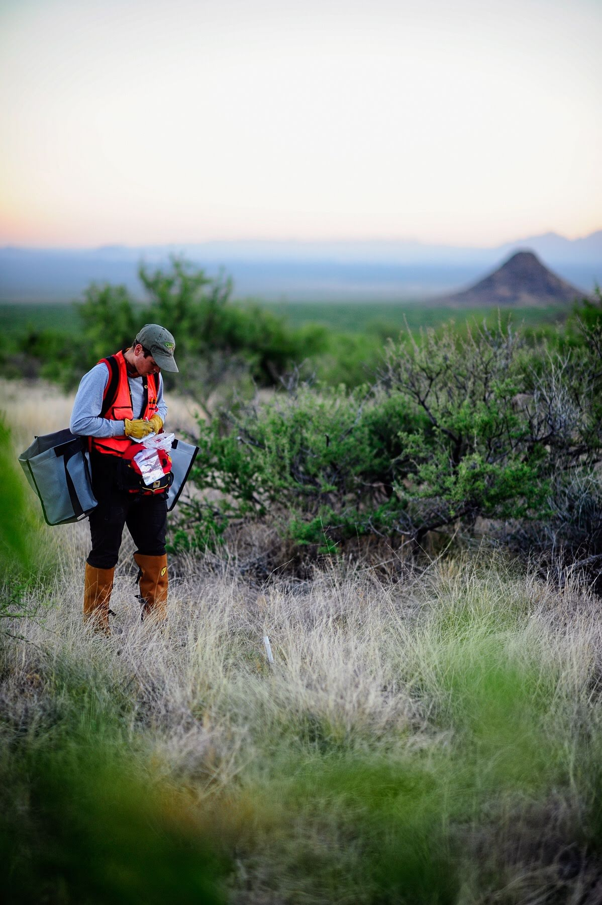
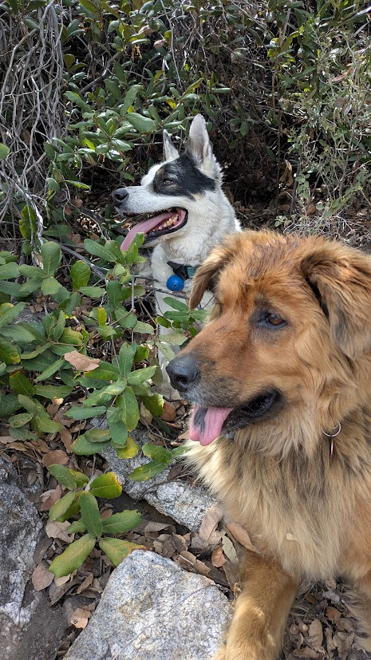

```{=html}
<div class="about-page">
  <header class="about-hero">
    <div class="about-hero__copy">
      <p class="signal-label"><span></span> About Tim</p>
      <h1>I came to data science through <em>fieldwork.</em></h1>
      <p>I’m an ecologist turned data scientist based in Tucson. I build data-collection apps, dashboards, databases, and automation tools for environmental consultants, research teams, and small organizations.</p>
      <div class="portfolio-actions"><a class="tg-btn tg-btn-primary" href="mailto:tsgilbert@arizona.edu">Email me</a><a class="tg-btn tg-btn-ghost" href="resume.qmd">View résumé</a></div>
    </div>
    <div class="about-hero__image"><span>Ecologist → data scientist</span></div>
  </header>

  <section class="about-story reveal">
    <div><p class="signal-label"><span></span> Background</p><h2>From field ecology to data products.</h2></div>
    <div><p>I started by collecting ecological data with the National Ecological Observatory Network (small-mammal trapping, electrofishing, vegetation surveys). I began teaching myself to code because I was curious about what happened to the data after it left the field.</p><p>Since 2022 I have built data applications at the University of Arizona, mostly in R and Python, and in 2025 I founded <a href="https://desertdatalabs.com/" target="_blank" rel="noopener">Desert Data Labs</a>. I’m also completing an M.S. in Data Science.</p><p>I design for the crew at the plot and for the report that has to land on a desk, because I have worked at both ends.</p></div>
  </section>

  <section class="about-facts reveal" aria-label="Quick facts">
    <article><span>Based in</span><strong>Tucson, Arizona</strong></article>
    <article><span>Builds with</span><strong>R, Python, SQL, Azure</strong></article>
    <article><span>Domain roots</span><strong>Ecology &amp; field science</strong></article>
    <article><span>Off screen</span><strong>Long hikes with my pups, ultra running, loved ones</strong></article>
  </section>

  <section class="about-gallery reveal">
    <figure class="about-gallery__wide"><figcaption>No signal out here, and the data still has to come back clean.</figcaption></figure>
    <figure><figcaption>Small mammal trapping. Years later I built a tracker out of NEON box-trapping records.</figcaption></figure>
    <figure><figcaption>The home team.</figcaption></figure>
  </section>

  <section class="portfolio-cta reveal">
    <p class="signal-label"><span></span> Connect</p>
    <h2>I want the messy field data, the database that has outgrown Excel, and the question nobody has had time to answer.</h2>
    <div class="contact-link-row"><a href="mailto:tsgilbert@arizona.edu">tsgilbert@arizona.edu</a><a href="https://github.com/tgilbert14" target="_blank" rel="noopener">GitHub ↗</a><a href="https://www.linkedin.com/in/tgilbert14" target="_blank" rel="noopener">LinkedIn ↗</a><a href="https://desertdatalabs.com/" target="_blank" rel="noopener">Desert Data Labs ↗</a></div>
  </section>
</div>
```
