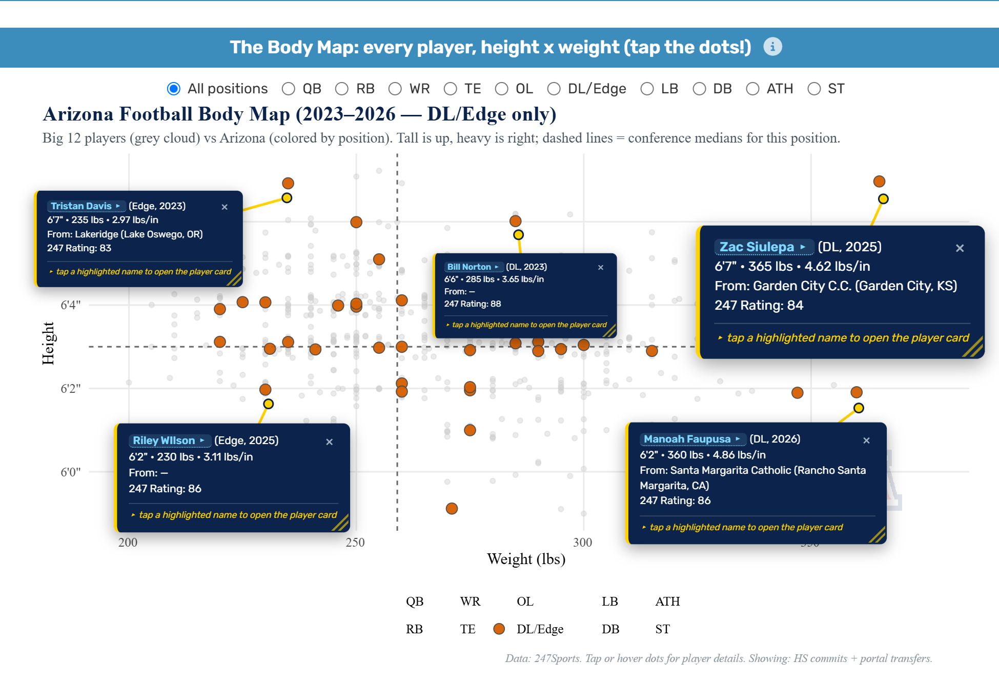
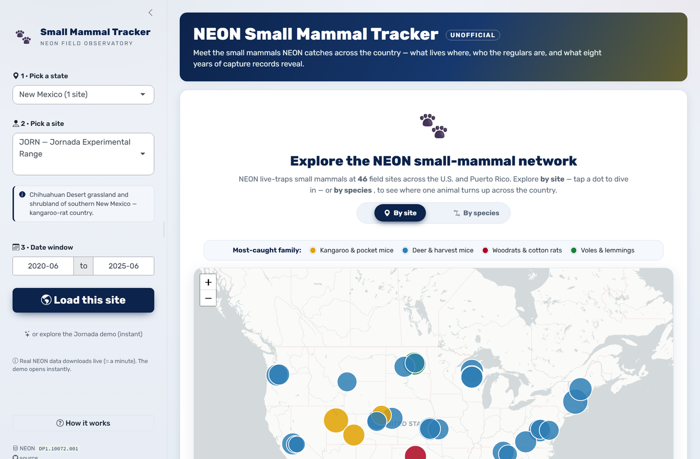
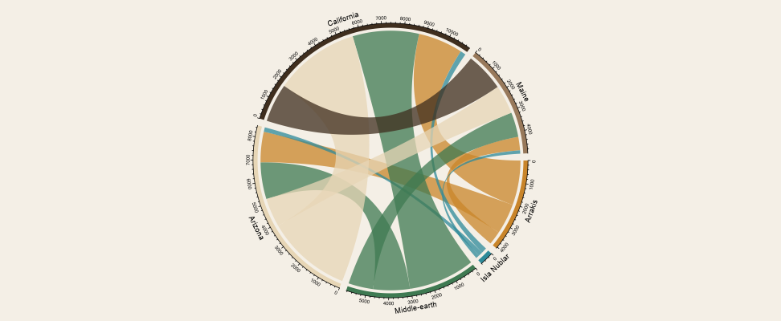

::: viz-intro
Shiny Applications...
:::

------------------------------------------------------------------------

::: {.reveal}

## Big 12 Girth Index — Recruiting Size Analytics

::: explore-text
This app visualizes **every Big 12 recruit's height, weight, and rating — 2016 to 2026, football and basketball, all 16 programs.** Plot any roster on the Body Map (height × weight, tap a dot to pin a player card), compare position-group weight distributions against the conference in Position DNA, project incoming defenders onto 3-3-5 odd-stack roles in the War Room, and track class ratings across coaching eras. Recruiting classes and rosters are scraped from 247Sports, with season records and SP+ from CollegeFootballData. A relaunch and major expansion of my earlier *Big-12 Talent Pathways* app.
:::

⭆ [Click for Stand Alone App](https://girthindex.desertdatalab.com/ "https://girthindex.desertdatalab.com/")

{.lightboxable} {.lightboxable}

:::

------------------------------------------------------------------------

::: {.reveal}

## NEON Small Mammal Tracker

::: explore-text
This shiny application turns National Ecological Observatory Network (<https://data.neonscience.org/>) box-trapping records into the **life history of every small mammal NEON has caught** across 46 field sites. It opens on a **tap-a-site national map** — pick a site to see who lives there, or flip to **"by species"** to map where one animal turns up across the country. Open any site for a **Hall of Fame** of the most-caught individuals (re-sortable, with rarity tiers), trap-grid **home-range** heatmaps, a **Hill-number diversity** profile, and **detection-corrected abundance** — closed-capture estimates (Schnabel / Chapman) that count the animals the traps missed, shown alongside MNKA. Plus shareable trading-card profiles, a two-site compare, and a printable report card. Methods are stated honestly: reused tags are flagged, Chao1 is a bias-corrected lower bound, and the size index is an adult weight percentile. Each site loads instantly from a pre-bundled, compressed dataset. A complete redesign of my original tracker.
:::

⭆ [Open the project](https://tgilbert14.github.io/NEON-Small-Mammal-Tracker-App/ "NEON Small Mammal Tracker")

{.lightboxable} {.lightboxable}

:::

------------------------------------------------------------------------

## Explore the NEON suite

```{=html}
<div class="neon-spider is-noscript" data-neon-spider aria-label="NEON explorer suite">
  <p class="neon-spider__intro" id="neon-spider-intro">
    Click the <strong>Driver Cascade</strong> to explore its sibling NEON flora, fauna, and
    aquatic apps. It fans the nine explorers out around the hub; click again to open the
    capstone itself, or tap any sibling to dive in.
  </p>

  <div class="neon-spider__stage" style="--n: 9;">
    <svg class="neon-spider__traces" viewBox="-260 -260 520 520" aria-hidden="true" focusable="false">
      <g class="neon-spider__traces-g"></g>
    </svg>

    <button type="button" class="neon-spider__hub"
            data-neon-hub aria-expanded="false" aria-haspopup="true"
            aria-describedby="neon-spider-intro">
      <span class="neon-spider__hub-pulse" aria-hidden="true"></span>
      <span class="neon-spider__hub-core">
        <span class="neon-spider__hub-title">NEON Driver Cascade</span>
        <span class="neon-spider__hub-state" data-neon-hub-state>Tap to explore</span>
      </span>
    </button>

    <ul class="neon-spider__nodes" data-neon-nodes>
      <li class="neon-spider__node" style="--i: 0;">
        <a class="neon-spider__link" href="https://tgilbert14.github.io/NEON-Small-Mammal-Tracker-App/">
          <span class="neon-spider__dot has-critter" aria-hidden="true"><svg class="mascot" viewBox="0 0 120 120"><g class="mascot-ear-l"><circle cx="42" cy="34" r="14" fill="#5aa0d8"/><circle cx="43" cy="36" r="8" fill="#ffd24a"/></g><g class="mascot-ear-r"><circle cx="78" cy="34" r="14" fill="#5aa0d8"/><circle cx="77" cy="36" r="8" fill="#ffd24a"/></g><path d="M88,82 Q110,94 113,72" fill="none" stroke="#5a93c8" stroke-width="4" stroke-linecap="round"/><ellipse cx="60" cy="66" rx="32" ry="33" fill="#5aa0d8"/><ellipse cx="60" cy="76" rx="20" ry="22" fill="#eaf2ff"/><path d="M55,70 Q60,68 65,70 Q62,77 60,77 Q58,77 55,70 Z" fill="#fb8a7e"/><g class="mascot-eyes"><circle cx="50" cy="60" r="6.5" fill="#0a1a2e"/><circle cx="70" cy="60" r="6.5" fill="#0a1a2e"/><circle cx="48" cy="57.5" r="2.4" fill="#fff"/><circle cx="68" cy="57.5" r="2.4" fill="#fff"/></g></svg></span>
          <span class="neon-spider__label">Small Mammals</span>
        </a>
      </li>
      <li class="neon-spider__node" style="--i: 1;">
        <a class="neon-spider__link" href="https://tgilbert14.github.io/NEON-Breeding-Birds/">
          <span class="neon-spider__dot has-critter" aria-hidden="true"><svg class="mascot" viewBox="0 0 120 120"><g fill="#f0b94a"><path d="M54,30 L57,16 L62,30 Z"/><path d="M62,30 L65,14 L70,30 Z"/></g><ellipse cx="60" cy="66" rx="32" ry="33" fill="#ffce5a"/><ellipse cx="60" cy="76" rx="19" ry="21" fill="#fff3d6"/><g class="mascot-ear-l"><path d="M30,58 Q14,66 22,86 Q34,80 40,64 Z" fill="#e0714a"/></g><g class="mascot-ear-r"><path d="M90,58 Q106,66 98,86 Q86,80 80,64 Z" fill="#e0714a"/></g><path d="M54,68 L66,68 L60,80 Z" fill="#f0993a"/><g class="mascot-eyes"><circle cx="50" cy="60" r="6.5" fill="#2a160a"/><circle cx="70" cy="60" r="6.5" fill="#2a160a"/><circle cx="48" cy="57.5" r="2.4" fill="#fff"/><circle cx="68" cy="57.5" r="2.4" fill="#fff"/></g></svg></span>
          <span class="neon-spider__label">Birds</span>
        </a>
      </li>
      <li class="neon-spider__node" style="--i: 2;">
        <a class="neon-spider__link" href="https://tgilbert14.github.io/NEON-Ground-Beetle-Tracker/">
          <span class="neon-spider__dot has-critter" aria-hidden="true"><svg class="mascot" viewBox="0 0 120 120"><g class="mascot-ear-l"><path d="M50,40 Q40,22 32,16" fill="none" stroke="#d98a3c" stroke-width="3" stroke-linecap="round"/><circle cx="32" cy="16" r="4" fill="#e8a24a"/></g><g class="mascot-ear-r"><path d="M70,40 Q80,22 88,16" fill="none" stroke="#d98a3c" stroke-width="3" stroke-linecap="round"/><circle cx="88" cy="16" r="4" fill="#e8a24a"/></g><g stroke="#c47a2c" stroke-width="3" stroke-linecap="round"><path d="M30,62 L16,62"/><path d="M30,78 L18,88"/><path d="M90,62 L104,62"/><path d="M90,78 L102,88"/></g><ellipse cx="60" cy="64" rx="31" ry="34" fill="#36d98a"/><path d="M60,32 L60,96" stroke="#176b46" stroke-width="2" opacity=".5"/><ellipse cx="60" cy="34" rx="14" ry="10" fill="#176b46"/><g class="mascot-eyes"><circle cx="50" cy="58" r="6.5" fill="#0c2a1c"/><circle cx="70" cy="58" r="6.5" fill="#0c2a1c"/><circle cx="48" cy="55.5" r="2.4" fill="#fff"/><circle cx="68" cy="55.5" r="2.4" fill="#fff"/></g></svg></span>
          <span class="neon-spider__label">Ground Beetles</span>
        </a>
      </li>
      <li class="neon-spider__node" style="--i: 3;">
        <a class="neon-spider__link" href="https://tgilbert14.github.io/NEON-Plant-Diversity/">
          <span class="neon-spider__dot has-critter" aria-hidden="true"><svg class="mascot" viewBox="0 0 120 120"><path d="M60,60 L60,30" stroke="#4aa050" stroke-width="4" stroke-linecap="round"/><g class="mascot-ear-l"><path d="M60,36 C40,24 24,30 22,46 C40,52 56,46 60,36 Z" fill="#5fd16a"/></g><g class="mascot-ear-r"><path d="M60,36 C80,24 96,30 98,46 C80,52 64,46 60,36 Z" fill="#5fd16a"/></g><ellipse cx="60" cy="76" rx="28" ry="26" fill="#d8cf9e"/><g class="mascot-eyes"><circle cx="51" cy="72" r="6" fill="#3a2a12"/><circle cx="69" cy="72" r="6" fill="#3a2a12"/><circle cx="49" cy="69.5" r="2.2" fill="#fff"/><circle cx="67" cy="69.5" r="2.2" fill="#fff"/></g></svg></span>
          <span class="neon-spider__label">Plant Diversity</span>
        </a>
      </li>
      <li class="neon-spider__node" style="--i: 4;">
        <a class="neon-spider__link" href="https://tgilbert14.github.io/NEON-Plant-Phenology-Explorer/">
          <span class="neon-spider__dot has-critter" aria-hidden="true"><svg class="mascot" viewBox="0 0 120 120"><path d="M60,98 L60,64" stroke="#5a9a3a" stroke-width="4" stroke-linecap="round"/><g class="mascot-ear-l"><path d="M52,40 C34,30 22,40 26,54 C42,54 52,48 52,40 Z" fill="#e6a92e"/></g><g class="mascot-ear-r"><path d="M68,40 C86,30 98,40 94,54 C78,54 68,48 68,40 Z" fill="#e6a92e"/></g><path d="M60,30 C48,30 44,46 52,58 L68,58 C76,46 72,30 60,30 Z" fill="#9bd24a"/><ellipse cx="60" cy="68" rx="26" ry="26" fill="#8cbf52"/><g class="mascot-eyes"><circle cx="51" cy="66" r="6" fill="#243a16"/><circle cx="69" cy="66" r="6" fill="#243a16"/><circle cx="49" cy="63.5" r="2.2" fill="#fff"/><circle cx="67" cy="63.5" r="2.2" fill="#fff"/></g></svg></span>
          <span class="neon-spider__label">Plant Phenology</span>
        </a>
      </li>
      <li class="neon-spider__node" style="--i: 5;">
        <a class="neon-spider__link" href="https://tgilbert14.github.io/NEON-Vegetation-Structure-Explorer/">
          <span class="neon-spider__dot has-critter" aria-hidden="true"><svg class="mascot" viewBox="0 0 120 120"><rect x="54" y="80" width="12" height="26" rx="3" fill="#8a5a2b"/><g class="mascot-ear-l"><circle cx="40" cy="44" r="15" fill="#4eb86a"/></g><g class="mascot-ear-r"><circle cx="80" cy="44" r="15" fill="#4eb86a"/></g><ellipse cx="60" cy="58" rx="34" ry="30" fill="#4eb86a"/><circle cx="42" cy="66" r="3" fill="#ffd24a"/><circle cx="80" cy="50" r="2.6" fill="#ffd24a"/><g class="mascot-eyes"><circle cx="51" cy="56" r="6.5" fill="#11331f"/><circle cx="69" cy="56" r="6.5" fill="#11331f"/><circle cx="49" cy="53.5" r="2.4" fill="#fff"/><circle cx="69" cy="53.5" r="2.4" fill="#fff"/></g></svg></span>
          <span class="neon-spider__label">Vegetation Structure</span>
        </a>
      </li>
      <li class="neon-spider__node" style="--i: 6;">
        <a class="neon-spider__link" href="https://tgilbert14.github.io/NEON-WaterChemistry-Analyte-Viewer-App/">
          <span class="neon-spider__dot has-critter" aria-hidden="true"><svg class="mascot" viewBox="0 0 120 120"><path d="M60,16 C36,52 28,72 60,98 C92,72 84,52 60,16 Z" fill="#46c6da"/><ellipse cx="48" cy="54" rx="6" ry="11" fill="#fff" opacity=".4" transform="rotate(-18 48 54)"/><g class="mascot-eyes"><circle cx="50" cy="64" r="6.5" fill="#0a2230"/><circle cx="70" cy="64" r="6.5" fill="#0a2230"/><circle cx="48" cy="61.5" r="2.4" fill="#fff"/><circle cx="68" cy="61.5" r="2.4" fill="#fff"/></g></svg></span>
          <span class="neon-spider__label">Water Chemistry</span>
        </a>
      </li>
      <li class="neon-spider__node" style="--i: 7;">
        <a class="neon-spider__link" href="https://tgilbert14.github.io/NEON-Mosquito-Pulse/">
          <span class="neon-spider__dot has-critter" aria-hidden="true"><svg class="mascot" viewBox="0 0 120 120"><g stroke="#b8f24a" stroke-width="3" stroke-linecap="round" fill="none"><path d="M52,40 Q46,26 50,18"/><path d="M68,40 Q74,26 70,18"/></g><g class="mascot-ear-l"><path d="M34,52 Q14,50 18,74 Q40,72 48,58 Z" fill="#b8f24a" fill-opacity=".9"/></g><g class="mascot-ear-r"><path d="M86,52 Q106,50 102,74 Q80,72 72,58 Z" fill="#b8f24a" fill-opacity=".9"/></g><ellipse cx="60" cy="64" rx="30" ry="33" fill="#7c52e0"/><ellipse cx="60" cy="74" rx="17" ry="19" fill="#cdb6ff"/><path d="M54,74 L66,74 L60,90 Z" fill="#ffc24a"/><g class="mascot-eyes"><circle cx="50" cy="58" r="7" fill="#1a1030"/><circle cx="70" cy="58" r="7" fill="#1a1030"/><circle cx="48" cy="55.5" r="2.5" fill="#fff"/><circle cx="68" cy="55.5" r="2.5" fill="#fff"/></g></svg></span>
          <span class="neon-spider__label">Mosquito Pulse</span>
        </a>
      </li>
      <li class="neon-spider__node" style="--i: 8;">
        <a class="neon-spider__link" href="https://tgilbert14.github.io/NEON-My-Little-Inverts/">
          <span class="neon-spider__dot has-critter" aria-hidden="true"><svg class="mascot" viewBox="0 0 120 120"><g stroke="#2bb7c4" stroke-width="3" stroke-linecap="round" fill="none"><path d="M50,38 Q44,24 48,16"/><path d="M70,38 Q76,24 72,16"/></g><g class="mascot-ear-l"><path d="M34,52 Q14,48 16,70 Q38,70 46,58 Z" fill="#7fe7ef" fill-opacity=".85"/></g><g class="mascot-ear-r"><path d="M86,52 Q106,48 104,70 Q82,70 74,58 Z" fill="#7fe7ef" fill-opacity=".85"/></g><g stroke="#0a6f7a" stroke-width="3" stroke-linecap="round" fill="none"><path d="M48,96 Q40,108 30,112"/><path d="M60,98 L60,114"/><path d="M72,96 Q80,108 90,112"/></g><ellipse cx="60" cy="64" rx="30" ry="34" fill="#2bb7c4"/><ellipse cx="60" cy="74" rx="17" ry="22" fill="#9beef5"/><g class="mascot-eyes"><circle cx="50" cy="58" r="6.5" fill="#0b2a30"/><circle cx="70" cy="58" r="6.5" fill="#0b2a30"/><circle cx="48" cy="55.5" r="2.4" fill="#fff"/><circle cx="68" cy="55.5" r="2.4" fill="#fff"/></g></svg></span>
          <span class="neon-spider__label">Little Inverts</span>
        </a>
      </li>
    </ul>

    <a class="neon-spider__hub-fallback" data-neon-hub-link
       href="https://tgilbert14.github.io/NEON-Driver-Cascade/">
      Open NEON Driver Cascade
    </a>
  </div>
</div>
```

------------------------------------------------------------------------

::: {.reveal}

## Which State's Flora Matches Each Movie World Best?

::: explore-text
This Shiny app asks which U.S. state's plant life best fits three movie worlds — **Dune (*Arrakis*)**, **The Lord of the Rings (*Middle-earth*)**, and **Jurassic Park (*Isla Nublar*)** — each defined by a curated set of plant families (desert & succulent, cool-forest & alpine, and ancient ferns & conifers). Pick any states and an **interactive bar chart** ranks their flora against each world; **tap a bar** to see exactly which families drive the score, and toggle **Raw counts → Fair share** to control for the fact that big, species-rich states and giant plant families — *Asteraceae* alone is ~65% of Arizona's "Middle-earth" score — would otherwise dominate. A **chord diagram** then maps the species each state shares with every world, and with the other states. Built on ~250,000 USDA PLANTS records precomputed into an ~11 KB bundle so it loads instantly. A full rebuild of the original — an honest, size-adjusted metric and a botanical field-guide redesign.
:::

⭆ [Open the app](https://tgilbert14.github.io/PlantsInMovies/ "Plants in Movies")

{.lightboxable} {.lightboxable}

:::

------------------------------------------------------------------------

::: {.reveal}

## Older Applications

***USFS Name Converter*** ⭆ [Click for Stand Alone App](https://t-lama.shinyapps.io/App-VGS-USFS-Name2VGS/ "https://t-lama.shinyapps.io/App-VGS-USFS-Name2VGS/")

:::

------------------------------------------------------------------------

::: {.card-container .reveal .stagger}
<a> </a> <a href="about.qmd" class="card card-about">ABOUT ME</a> <a href="dashboards.qmd" class="card card-visualizations">SHINY APPS</a> <a href="projects.qmd" class="card card-projects">PROJECTS</a> <a href="resume.qmd" class="card card-resume">RESUME/CV</a>
:::
