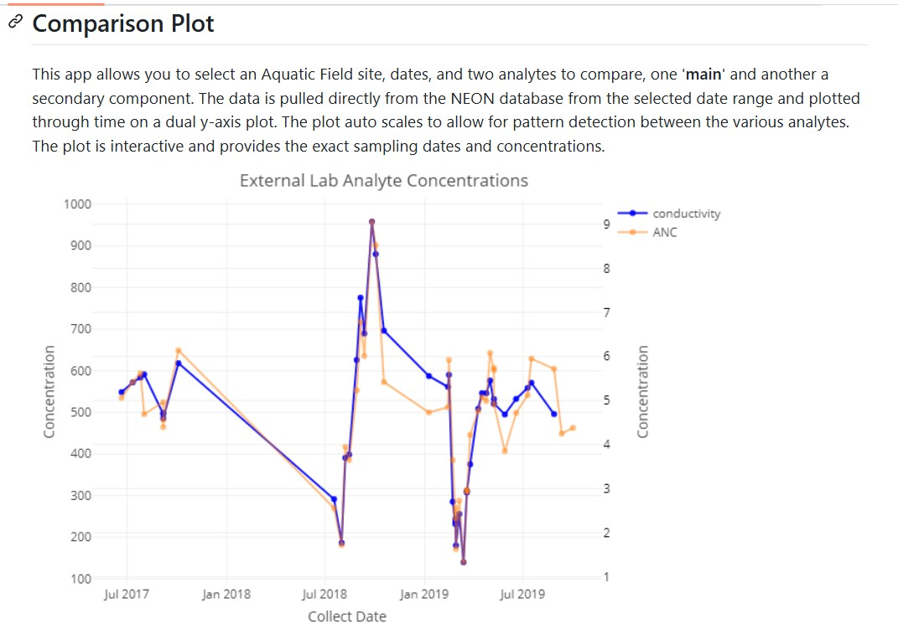
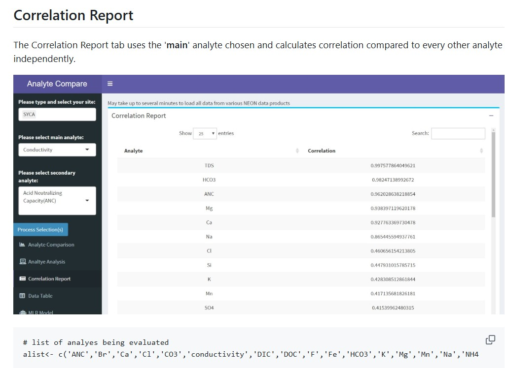
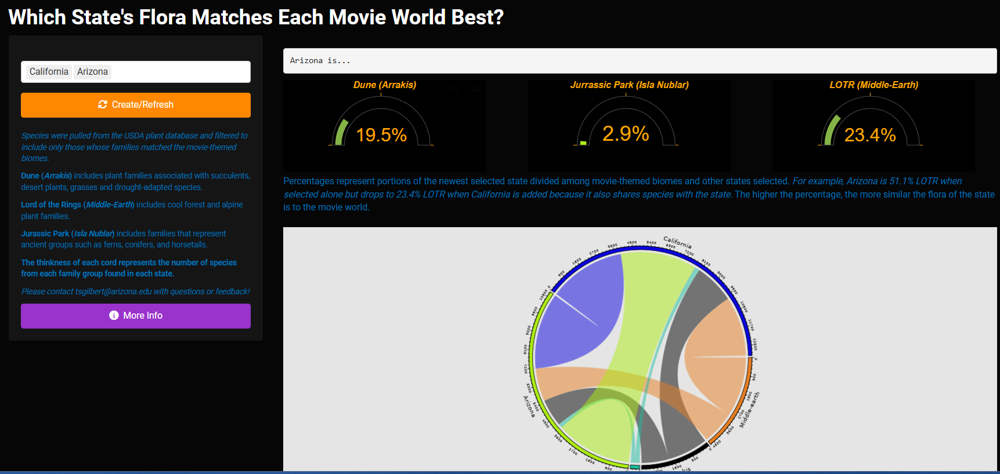
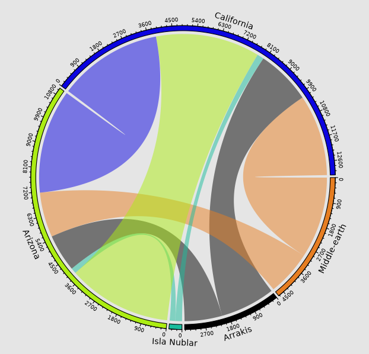

::: viz-intro
Shiny Applications...
:::

------------------------------------------------------------------------

## Big 12 Girth Index — Recruiting Size Analytics

::: explore-text
This app visualizes **every Big 12 recruit's height, weight, and rating — 2016 to 2026, football and basketball, all 16 programs.** Plot any roster on the Body Map (height × weight, tap a dot to pin a player card), compare position-group weight distributions against the conference in Position DNA, project incoming defenders onto 3-3-5 odd-stack roles in the War Room, and track class ratings across coaching eras. Recruiting classes and rosters are scraped from 247Sports, with season records and SP+ from CollegeFootballData. A relaunch and major expansion of my earlier *Big-12 Talent Pathways* app.
:::

⭆ [Click for Stand Alone App](https://girthindex.desertdatalab.com/ "https://girthindex.desertdatalab.com/")

 

------------------------------------------------------------------------

## NEON Small Mammal Tracker

::: explore-text
This shiny application turns National Ecological Observatory Network (<https://data.neonscience.org/>) box-trapping records into the **life history of every small mammal NEON has caught** across 46 field sites. It opens on a **tap-a-site national map** — pick a site to see who lives there, or flip to **"by species"** to map where one animal turns up across the country. Open any site for a **Hall of Fame** of the most-caught individuals (re-sortable, with rarity tiers), trap-grid **home-range** heatmaps, a **Hill-number diversity** profile, and **detection-corrected abundance** — closed-capture estimates (Schnabel / Chapman) that count the animals the traps missed, shown alongside MNKA. Plus shareable trading-card profiles, a two-site compare, and a printable report card. Methods are stated honestly: reused tags are flagged, Chao1 is a bias-corrected lower bound, and the size index is an adult weight percentile. Each site loads instantly from a pre-bundled, compressed dataset. A complete redesign of my original tracker.
:::

⭆ [Open the project](https://tgilbert14.github.io/NEON-Small-Mammal-Tracker-App/ "NEON Small Mammal Tracker")

 

------------------------------------------------------------------------

## Water Chemistry Analyte Viewer

::: explore-text
This Shiny app compares **surface-water chemistry across 34 NEON aquatic field sites** — from desert streams to Alaskan lakes to Puerto Rican rivers. Pick any two analytes and see how they move together through time, how they relate, what else they correlate with, and their seasonal pattern, on roughly **197,000 real measurements** with statistics that show their work: a normalized or dual-axis **time series**, a least-squares **relationship** fit with R²/p/n and a temporal-autocorrelation flag, a **Spearman correlation** screen with per-row sample sizes, a real **STL seasonal decomposition** (the measured cycle, not a synthetic sine wave), and a small **predictor** that estimates an analyte from its best-correlated neighbors, scored against a mean-only baseline. Chemistry names and units are correct, below-detection values are flagged rather than hidden, and every statistic shows its *n*. Loads instantly from a pre-bundled dataset — no live API waits.
:::

⭆ [Open the project](https://tgilbert14.github.io/NEON-WaterChemistry-Analyte-Viewer-App/ "Water Chemistry Analyte Viewer")

 

------------------------------------------------------------------------

## Which State's Flora Matches Each Movie World Best?

::: explore-text
This shiny app creates a chord diagram that shows the number of shared species between states selected and the movie themed worlds **Dune (*Arrakis*)**, **Lord of the Rings (*Middle-Earth*) and Jurassic Park (Isla Nublar).** Percent gauge plots are also created showing the portions of the newest selected state divided among movie-themed biomes and the other selected states.
:::

⭆ [Click for Stand Alone App](https://t-lama.shinyapps.io/PlantsInMovies/ "https://t-lama.shinyapps.io/PlantsInMovies/")

 

------------------------------------------------------------------------

## Older Applications

***USFS Name Converter*** ⭆ [Click for Stand Alone App](https://t-lama.shinyapps.io/App-VGS-USFS-Name2VGS/ "https://t-lama.shinyapps.io/App-VGS-USFS-Name2VGS/")

------------------------------------------------------------------------

::: card-container
 <a href="about.qmd" class="card card-about">ABOUT ME</a> <a href="dashboards.qmd" class="card card-visualizations">SHINY APPS</a> <a href="projects.qmd" class="card card-projects">PROJECTS</a> <a href="resume.qmd" class="card card-resume">RESUME/CV</a>
:::
