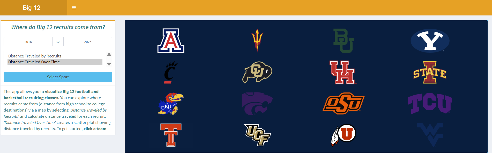
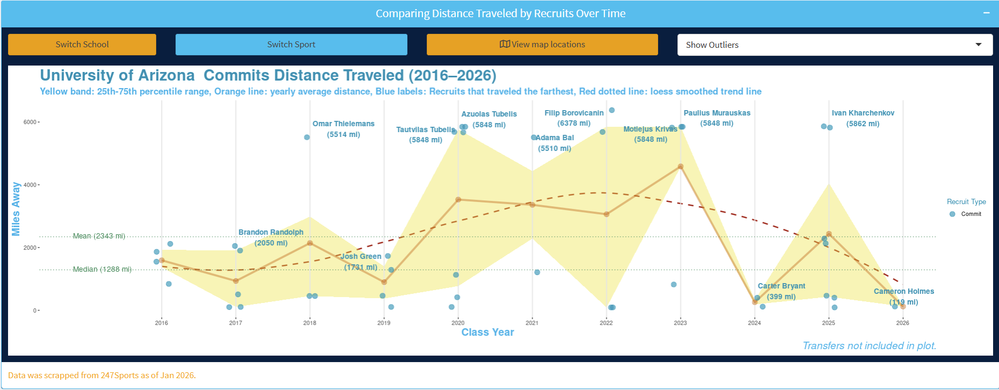

::: viz-intro
Shiny Applications...
:::

------------------------------------------------------------------------

## Where Do Big 12 Recruits Come From?

::: explore-text
This app allows you to **visualize Big 12 football and basketball recruiting classes.** You can explore where recruits came from (distance from high school to college destinations) via a map by selecting *'Distance Traveled by Recruits'* and calculate distance traveled for each recruit. *'Distance Traveled Over Time'* creates a scatter plot showing distance traveled by recruits. To get started, **click a team**.
:::

⭆ [Click for Stand Alone App](https://t-lama.shinyapps.io/Big-12-Talent-Pathways/ "https://t-lama.shinyapps.io/Big-12-Talent-Pathways/")

 

------------------------------------------------------------------------

## Small Mammal Tracker

::: explore-text
This shiny application uses National Ecological Observatory Network (<https://data.neonscience.org/>) data to compare **small mammal capture data** across various NEON sites based on a location and date range selection, then ranks them in order of total number captures by identifying tags of individuals. Individuals can be picked out to look at patterns and capture history. Capture summary plots by site and other site level plots are also available.
:::

⭆ [Click for Stand Alone App](https://t-lama.shinyapps.io/RatTrapHistory/ "https://t-lama.shinyapps.io/RatTrapHistory/")

 

------------------------------------------------------------------------

## Which State's Flora Matches Each Movie World Best?

::: explore-text
This shiny app creates a chord diagram that shows the number of shared species between states selected and the movie themed worlds **Dune (*Arrakis*)**, **Lord of the Rings (*Middle-Earth*) and Jurassic Park (Isla Nublar).** Percent gauge plots are also created showing the portions of the newest selected state divided among movie-themed biomes and the other selected states.
:::

⭆ [Click for Stand Alone App](https://t-lama.shinyapps.io/PlantsInMovies/ "https://t-lama.shinyapps.io/PlantsInMovies/")

 

------------------------------------------------------------------------

## Older Applications

***USFS Name Converter*** ⭆ [Click for Stand Alone App](https://t-lama.shinyapps.io/App-VGS-USFS-Name2VGS/ "https://t-lama.shinyapps.io/App-VGS-USFS-Name2VGS/")

***Water Chemistry Analyte Viewer*** ⭆ [Click for Stand Alone App](https://t-lama.shinyapps.io/AnalyteViewer/ "https://t-lama.shinyapps.io/AnalyteViewer/")

------------------------------------------------------------------------

::: card-container
 <a href="about.qmd" class="card card-about">ABOUT ME</a> <a href="dashboards.qmd" class="card card-visualizations">SHINY APPS</a> <a href="projects.qmd" class="card card-projects">PROJECTS</a> <a href="resume.qmd" class="card card-resume">RESUME/CV</a>
:::
