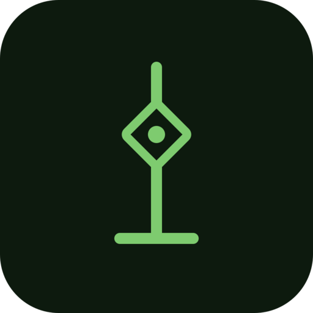
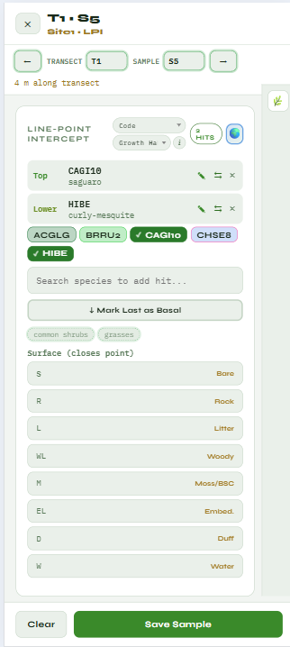
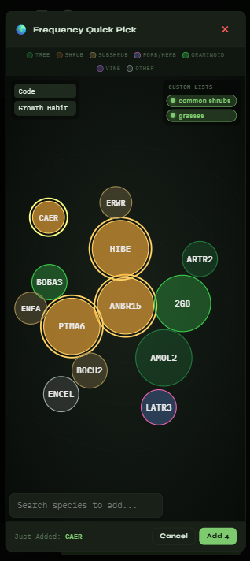
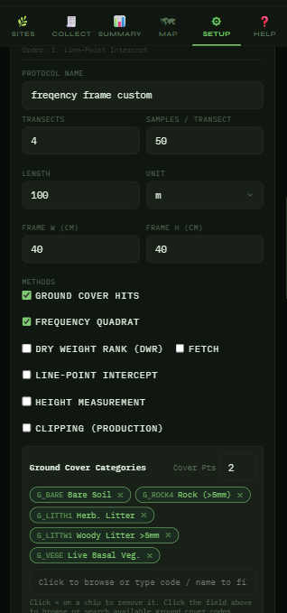

```{=html}
<section class="eco-hero">
  
  <span class="eyebrow">Flagship · Field data platform</span>
  <h1>EcoPlot <span class="accent">Mobile</span></h1>
  <p class="lede">An offline-first app for collecting vegetation &amp; ecological data in the field — then syncing it to a hosted database and turning it into reports. I architect and build it as the flagship platform for <a href="https://desertdatalabs.com/" target="_blank" rel="noopener">Desert Data Labs</a>.</p>
  <div class="cta-row">
    <a class="tg-btn tg-btn-primary" href="https://app.desertdatacollection.com/" target="_blank" rel="noopener">Open the live app ↗</a>
    <a class="tg-btn tg-btn-ghost" href="https://app.desertdatacollection.com/office-portal.html?demo=1" target="_blank" rel="noopener">Office Portal demo ↗</a>
  </div>
</section>
```

::: {.tg-section .reveal style="padding-top:0;"}
The successor to a decade of desktop rangeland-monitoring tools — rebuilt as a modern **Progressive Web App** so a field crew can collect data on a phone with no signal, an office analyst can review it from a desk, and a rancher or agency can get a report out the other end. Built on Azure, it runs in the browser on any device with **no installer and no app store**.
:::

::: {.tg-section .reveal}
::: section-label
What it does
:::

```{=html}
<div class="cap-grid reveal stagger">
  <div class="cap-card"><span class="cap-ico"><svg viewBox="0 0 24 24" fill="none" stroke="currentColor" stroke-width="1.8" stroke-linecap="round" stroke-linejoin="round"><path d="M12 20h.01"/><path d="M8.5 16.429a5 5 0 0 1 7 0"/><path d="M5 12.859a10 10 0 0 1 5.17-2.69"/><path d="M19 12.859a10 10 0 0 0-2.007-1.523"/><path d="M2 8.82a15 15 0 0 1 4.177-2.643"/><path d="M22 8.82a15 15 0 0 0-11.288-3.764"/><path d="m2 2 20 20"/></svg></span><h3>Works fully offline</h3><p>Collect deep in the backcountry with no signal — everything is stored on-device and syncs once you're back online. No dropped data.</p></div>
  <div class="cap-card"><span class="cap-ico"><svg viewBox="0 0 24 24" fill="none" stroke="currentColor" stroke-width="1.8" stroke-linecap="round" stroke-linejoin="round"><rect width="14" height="20" x="5" y="2" rx="2" ry="2"/><path d="M12 18h.01"/></svg></span><h3>Any device, no app store</h3><p>It's a PWA — runs in the browser on iOS, Android, tablet and desktop. Nothing to install, nothing to keep updated.</p></div>
  <div class="cap-card"><span class="cap-ico"><svg viewBox="0 0 24 24" fill="none" stroke="currentColor" stroke-width="1.8" stroke-linecap="round" stroke-linejoin="round"><path d="M12 13v8"/><path d="M4 14.899A7 7 0 1 1 15.71 8h1.79a4.5 4.5 0 0 1 2.5 8.242"/><path d="m8 17 4-4 4 4"/></svg></span><h3>Syncs to the cloud</h3><p>Offline edits reconcile to a managed Azure SQL database — with delete propagation, delta downloads and concurrent-edit detection.</p></div>
  <div class="cap-card"><span class="cap-ico"><svg viewBox="0 0 24 24" fill="none" stroke="currentColor" stroke-width="1.8" stroke-linecap="round" stroke-linejoin="round"><rect width="8" height="4" x="8" y="2" rx="1" ry="1"/><path d="M16 4h2a2 2 0 0 1 2 2v14a2 2 0 0 1-2 2H6a2 2 0 0 1-2-2V6a2 2 0 0 1 2-2h2"/><path d="M12 11h4"/><path d="M12 16h4"/><path d="M8 11h.01"/><path d="M8 16h.01"/></svg></span><h3>Built-in &amp; custom protocols</h3><p>Frequency, Line-Point Intercept, Cover, Dry-Weight Rank, Clipping / Production, Height — or build your own protocol from scratch.</p></div>
  <div class="cap-card"><span class="cap-ico"><svg viewBox="0 0 24 24" fill="none" stroke="currentColor" stroke-width="1.8" stroke-linecap="round" stroke-linejoin="round"><path d="M11 20A7 7 0 0 1 9.8 6.1C15.5 5 17 4.48 19 2c1 2 2 4.18 2 8 0 5.5-4.78 10-10 10Z"/><path d="M2 21c0-3 1.85-5.36 5.08-6"/></svg></span><h3>Fast species entry</h3><p>A search box plus a "bubble picker" that resizes by frequency; color by growth habit, duration or native status; add qualifiers on the fly.</p></div>
  <div class="cap-card"><span class="cap-ico"><svg viewBox="0 0 24 24" fill="none" stroke="currentColor" stroke-width="1.8" stroke-linecap="round" stroke-linejoin="round"><path d="M20 10c0 6-8 12-8 12s-8-6-8-12a8 8 0 0 1 16 0Z"/><circle cx="12" cy="10" r="3"/></svg></span><h3>Photos, GPS &amp; maps</h3><p>Geotagged photos, site maps with live fire perimeters and land-ownership overlays, offline map tiles and marker clustering.</p></div>
  <div class="cap-card"><span class="cap-ico"><svg viewBox="0 0 24 24" fill="none" stroke="currentColor" stroke-width="1.8" stroke-linecap="round" stroke-linejoin="round"><rect width="7" height="9" x="3" y="3" rx="1"/><rect width="7" height="5" x="14" y="3" rx="1"/><rect width="7" height="9" x="14" y="12" rx="1"/><rect width="7" height="5" x="3" y="16" rx="1"/></svg></span><h3>Office Data Portal</h3><p>A read-only desk companion: frequency trends over time, top-species charts, a site map and a filterable data inventory.</p></div>
  <div class="cap-card"><span class="cap-ico"><svg viewBox="0 0 24 24" fill="none" stroke="currentColor" stroke-width="1.8" stroke-linecap="round" stroke-linejoin="round"><path d="M21 15v4a2 2 0 0 1-2 2H5a2 2 0 0 1-2-2v-4"/><polyline points="7 10 12 15 17 10"/><line x1="12" y1="15" x2="12" y2="3"/></svg></span><h3>Reports &amp; exports</h3><p>Production / stocking-rate and species PDFs, plus tidy long-format CSV exports ready to drop into R or Excel.</p></div>
  <div class="cap-card"><span class="cap-ico"><svg viewBox="0 0 24 24" fill="none" stroke="currentColor" stroke-width="1.8" stroke-linecap="round" stroke-linejoin="round"><path d="M20 13c0 5-3.5 7.5-7.66 8.95a1 1 0 0 1-.67-.01C7.5 20.5 4 18 4 13V6a1 1 0 0 1 1-1c2 0 4.5-1.2 6.24-2.72a1.17 1.17 0 0 1 1.52 0C14.51 3.81 17 5 19 5a1 1 0 0 1 1 1Z"/><path d="m9 12 2 2 4-4"/></svg></span><h3>Multi-tenant &amp; secure</h3><p>Each client gets an isolated database; per-workspace membership gating keeps every organization's data separated.</p></div>
</div>
```
:::

::: {.tg-section .reveal}
::: section-label
From field to report
:::

```{=html}
<div class="eco-flow">
  <div class="eco-step"><span class="eco-num">1</span><h4>Collect</h4><p>A crew taps through samples in the field — offline, one thumb, bad lighting.</p></div>
  <div class="eco-step"><span class="eco-num">2</span><h4>Sync</h4><p>Back on signal, edits reconcile to the hosted Azure SQL database.</p></div>
  <div class="eco-step"><span class="eco-num">3</span><h4>Review</h4><p>A PI, forester or ranch manager opens the Office Portal from a desk.</p></div>
  <div class="eco-step"><span class="eco-num">4</span><h4>Report</h4><p>Export permit-ready PDFs and tidy CSVs — the deliverable, not raw data.</p></div>
</div>
```
:::

::: {.tg-section .reveal}
::: section-label
A look inside
:::

```{=html}
<div class="shot-grid">
  <figure><figcaption>Collecting Line-Point Intercept data</figcaption></figure>
  <figure><figcaption>Frequency collection — the bubble picker</figcaption></figure>
  <figure><figcaption>Site view</figcaption></figure>
  <figure><figcaption>Building a custom protocol</figcaption></figure>
</div>
```
:::

::: {.tg-section .reveal}
::: section-label
Under the hood
:::

```{=html}
<div class="chip-row">
  <span class="chip">Progressive Web App</span>
  <span class="chip">Offline-first</span>
  <span class="chip">Service Worker</span>
  <span class="chip">IndexedDB</span>
  <span class="chip">Azure Static Web Apps</span>
  <span class="chip">Azure SQL</span>
  <span class="chip">Azure Functions</span>
  <span class="chip">Blob Storage (photos)</span>
  <span class="chip">Leaflet maps</span>
  <span class="chip">Multi-tenant</span>
</div>
```

::: {style="text-align:center; margin-top:2rem;"}
<a href="https://app.desertdatacollection.com/?demo=frequency" class="tg-btn tg-btn-ghost" target="_blank" rel="noopener">Try the frequency demo ↗</a> <a href="field-notes.qmd" class="tg-btn tg-btn-salmon">See the fieldwork behind it →</a>
:::
:::
