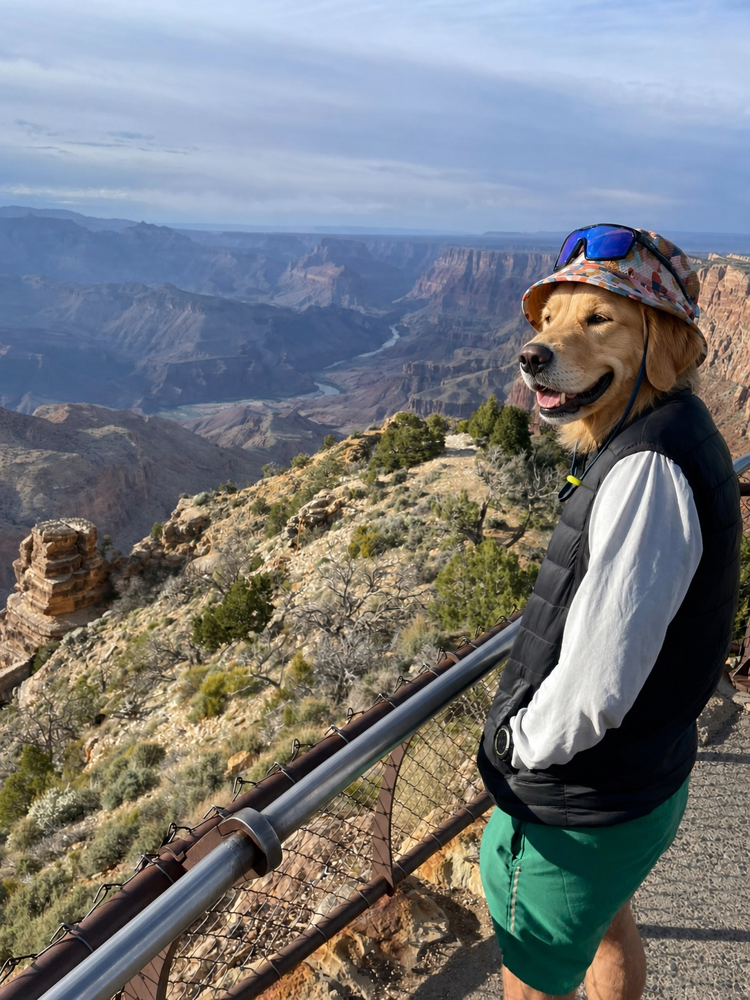

```{=html}
<div class="portfolio-home portfolio-home--wild">
  <section class="portfolio-hero portfolio-hero--wild" aria-labelledby="hero-title" data-wild-hero>
    <div class="hero-grid" aria-hidden="true"></div>
    <div class="portfolio-hero__copy">
      <p class="signal-label"><span></span> Tim Gilbert / Tucson, Arizona</p>
      <h1 id="hero-title">Apps for ecologists, sports fans &amp; <em>nerds.</em></h1>
      <p class="portfolio-hero__lede">I’m an ecologist and data scientist who builds R Shiny apps, databases, scrapers, offline field tools, and unnecessarily ambitious browser experiments. I like making complicated things easier—and a lot more fun—to use.</p>
      <div class="portfolio-actions">
        <a class="tg-btn tg-btn-primary" href="#interactive-web">Start with the fun stuff <span aria-hidden="true">↓</span></a>
        <a class="tg-btn tg-btn-ghost" href="#apps-and-systems">Apps &amp; systems</a>
      </div>
      <div class="hero-signoff">
        <span>Ecologist</span><i aria-hidden="true">+</i><span>Data scientist</span><i aria-hidden="true">+</i><span>Builder of odd little worlds</span>
      </div>
    </div>

    <div class="hero-self-portrait" data-tilt-card data-portrait-morph>
      <p class="portrait-kicker"><span></span> Field identification / TG-14</p>
      <div class="hero-self-portrait__frame">
        
        
        <div class="portrait-holo-gate" aria-hidden="true"><i></i><i></i><i></i></div>
        <span class="portrait-coordinate">36.10° N / 112.11° W</span>
        <span class="portrait-status"><i aria-hidden="true"></i><span class="portrait-status__real">FIELD RECORD ACTIVE</span><span class="portrait-status__dog">CANIS MODE ACTIVE</span></span>
        <button class="portrait-toggle" type="button" aria-pressed="false" aria-label="Toggle alternate dog portrait" data-portrait-toggle><span>ALT SPECIMEN</span><i aria-hidden="true">↻</i></button>
      </div>
      <div class="hero-self-portrait__caption">
        <div><small>SUBJECT</small><strong>Tim Gilbert</strong></div>
        <div><small>RANGE</small><strong>Mostly Arizona</strong></div>
      </div>
      <span class="portrait-chip portrait-chip--r" aria-hidden="true">R</span>
      <span class="portrait-chip portrait-chip--sql" aria-hidden="true">SQL</span>
      <span class="portrait-chip portrait-chip--field" aria-hidden="true">FIELD</span>
    </div>
  </section>

  <div class="build-ticker" aria-label="Tools and subjects used across Tim's work">
    <div class="build-ticker__track">
      <span>R SHINY</span><i>✶</i><span>PYTHON</span><i>✶</i><span>SQL</span><i>✶</i><span>CANVAS</span><i>✶</i><span>FIELD ECOLOGY</span><i>✶</i><span>SPORTS DATA</span><i>✶</i><span>OFFLINE-FIRST</span><i>✶</i><span>WEIRD SIDE PROJECTS</span><i>✶</i>
      <span aria-hidden="true">R SHINY</span><i aria-hidden="true">✶</i><span aria-hidden="true">PYTHON</span><i aria-hidden="true">✶</i><span aria-hidden="true">SQL</span><i aria-hidden="true">✶</i><span aria-hidden="true">CANVAS</span><i aria-hidden="true">✶</i><span aria-hidden="true">FIELD ECOLOGY</span><i aria-hidden="true">✶</i><span aria-hidden="true">SPORTS DATA</span><i aria-hidden="true">✶</i><span aria-hidden="true">OFFLINE-FIRST</span><i aria-hidden="true">✶</i><span aria-hidden="true">WEIRD SIDE PROJECTS</span><i aria-hidden="true">✶</i>
    </div>
  </div>

  <section class="portfolio-section interactive-web interactive-web--lead" id="interactive-web">
    <div class="section-heading reveal">
      <div><p class="signal-label"><span></span> New interactive websites</p><h2>A Tucson Saturday. A mountain road. A dead spaceship.</h2></div>
      <p>Three browser experiments built from scratch with Canvas, sound, scroll choreography, and an unreasonable amount of attention to tiny details.</p>
    </div>
    <div class="web-project-grid web-project-grid--loud">
      <a class="web-project reveal" href="https://tgilbert14.github.io/old-pueblo/" target="_blank" rel="noopener" data-reactive-card>
        <div class="web-project__image"><span>Scroll + sound</span></div>
        <div class="web-project__copy"><p>The Long Saturday</p><h3>One desert day, from first light to kickoff.</h3><small>Film scrubbing · field-recorded soundscape · four scroll movements</small><b>Enter the story ↗</b></div>
      </a>
      <a class="web-project reveal" href="https://tgilbert14.github.io/ddl-27-miles/" target="_blank" rel="noopener" data-reactive-card>
        <div class="web-project__image"><span>Procedural Canvas</span></div>
        <div class="web-project__copy"><p>27 Miles to Canada</p><h3>Drive from saguaros to snow in twenty-seven miles.</h3><small>Six biotic communities · elevation model · live climate shift</small><b>Start the climb ↗</b></div>
      </a>
      <a class="web-project reveal" href="https://tgilbert14.github.io/ddl-orrery/" target="_blank" rel="noopener" data-reactive-card>
        <div class="web-project__image"><span>Procedural world</span></div>
        <div class="web-project__copy"><p>The Orrery</p><h3>Eleven worlds keep time around one dead ship.</h3><small>Canvas-baked planets · generative score · shuttle flight · hidden sector</small><b>Choose a world ↗</b></div>
      </a>
    </div>
  </section>

  <section class="portfolio-section apps-section" id="apps-and-systems">
    <div class="section-heading reveal">
      <div><p class="signal-label"><span></span> Apps + systems</p><h2>Then there’s the useful stuff.</h2></div>
      <p>Field data, football recruits, small mammals, and movie botany. Different subjects; same habit of turning messy data into something worth exploring.</p>
    </div>

    <div class="app-grid">
      <article class="app-card app-card--ecoplot reveal" data-reactive-card>
        <div class="app-card__image app-card__image--ecoplot">
          
          <div class="ecoplot-status"><i aria-hidden="true"></i><span>OFFLINE · 12 SAFE</span></div>
          <div class="ecoplot-device" aria-hidden="true"><i></i></div>
          <div class="ecoplot-route" aria-hidden="true"><i></i><i></i><i></i></div>
          <div class="ecoplot-database" aria-hidden="true"><i></i><i></i><i></i><b>SQL</b></div>
          <span>01 / FIELD → DATABASE</span>
        </div>
        <div class="app-card__copy"><h3>EcoPlot Mobile</h3><p>Offline vegetation data collection, cloud sync, office review, and reports. Built for places where the bars on your phone are mostly decorative.</p><ul class="tech-list"><li>PWA</li><li>Azure SQL</li><li>Offline sync</li></ul><div class="case-links"><a href="ecoplot.qmd">Case study →</a><a href="https://app.desertdatacollection.com/" target="_blank" rel="noopener">Live app ↗</a></div></div>
      </article>

      <article class="app-card reveal" data-reactive-card>
        <div class="app-card__image"><span>02 / SPORTS</span></div>
        <div class="app-card__copy"><h3>Big 12 Girth Index</h3><p>Height, weight, ratings, position DNA, coaching eras, and a 3–3–5 War Room for every Big 12 program. Yes, the name is intentional.</p><ul class="tech-list"><li>R Shiny</li><li>Scraping</li><li>Plotly</li></ul><div class="case-links"><a href="https://girthindex.desertdatalab.com/" target="_blank" rel="noopener">Open app ↗</a></div></div>
      </article>

      <article class="app-card reveal" data-reactive-card>
        <div class="app-card__image"><span>03 / ECOLOGY</span></div>
        <div class="app-card__copy"><h3>Small Mammal Tracker</h3><p>National trapping records turned into animal histories, home ranges, diversity profiles, and a Hall of Fame for the most-caught little weirdos.</p><ul class="tech-list"><li>R</li><li>Mapping</li><li>Ecological stats</li></ul><div class="case-links"><a href="https://tgilbert14.github.io/NEON-Small-Mammal-Tracker-App/" target="_blank" rel="noopener">Open app ↗</a></div></div>
      </article>

      <article class="app-card reveal" data-reactive-card>
        <div class="app-card__image"><span>04 / BOTANY?</span></div>
        <div class="app-card__copy"><h3>Plants in Movies</h3><p>Which state has the flora of Arrakis, Middle-earth, or Isla Nublar? Roughly 250,000 USDA records were apparently the reasonable way to answer that.</p><ul class="tech-list"><li>R Shiny</li><li>USDA data</li><li>Chord diagrams</li></ul><div class="case-links"><a href="https://tgilbert14.github.io/PlantsInMovies/" target="_blank" rel="noopener">Open app ↗</a></div></div>
      </article>
    </div>

    <div class="section-end-link reveal"><a href="work.qmd">Everything else I’ve built <span aria-hidden="true">→</span></a></div>
  </section>

  <section class="portfolio-section proof-ledger reveal" aria-labelledby="proof-title">
    <div class="proof-ledger__head">
      <p class="signal-label"><span></span> A few receipts</p>
      <h2 id="proof-title">Real projects. Real records.</h2>
    </div>
    <div class="proof-ledger__grid">
      <article data-reactive-card><strong data-count-to="178" data-count-suffix="k+">178k+</strong><span>Mammal capture records made navigable</span></article>
      <article data-reactive-card><strong data-count-to="46">46</strong><span>NEON field sites in one tracker</span></article>
      <article data-reactive-card><strong data-count-to="250" data-count-suffix="k+">250k+</strong><span>USDA plant records compared with movie worlds</span></article>
    </div>
  </section>

  <section class="portfolio-section capabilities-section">
    <div class="section-heading reveal">
      <div><p class="signal-label"><span></span> Under the hood</p><h2>I do the database, the interface, and the field logic.</h2></div>
      <p>I’m happiest when I can understand the weird edge case, model it correctly, and make the finished thing feel obvious.</p>
    </div>
    <div class="capability-grid">
      <article class="capability-card reveal" data-reactive-card><span>01</span><h3>Build the thing</h3><p>R Shiny apps, progressive web apps, desktop helpers, and framework-free browser experiments.</p><small>R · Python · JavaScript · Electron</small></article>
      <article class="capability-card reveal" data-reactive-card><span>02</span><h3>Wire the data</h3><p>Relational models, offline sync, ETL pipelines, scrapers, and QA/QC that survive real use.</p><small>SQL · Azure · SQLite · APIs</small></article>
      <article class="capability-card reveal" data-reactive-card><span>03</span><h3>Know the field</h3><p>Years of ecological work mean the protocol, the crew, and the no-signal edge case are never afterthoughts.</p><small>Vegetation · Wildlife · Spatial data</small></article>
      <article class="capability-card reveal" data-reactive-card><span>04</span><h3>Make it interesting</h3><p>Maps, charts, motion, sound, and visual systems that reward curiosity instead of flattening it.</p><small>Canvas · Plotly · ggplot2 · Audio</small></article>
    </div>
  </section>

  <section class="field-story field-story--wild reveal">
    <div class="field-story__image"></div>
    <div class="field-story__copy">
      <p class="signal-label"><span></span> Before the code</p>
      <h2>I learned the data before I learned the stack.</h2>
      <p>Small-mammal trapping, vegetation surveys, electrofishing, soil work—the field came first. That still shapes every offline workflow, validation rule, and interface decision I make.</p>
      <div><a class="tg-btn tg-btn-primary" href="about.qmd">The longer story</a><a class="tg-btn tg-btn-ghost" href="field-notes.qmd">Field notes</a></div>
    </div>
  </section>

  <section class="portfolio-cta portfolio-cta--wild reveal">
    <p class="signal-label"><span></span> Send me the weird one</p>
    <h2>Got a cursed spreadsheet, a strange dataset, or an app idea nobody else understands?</h2>
    <p>That is probably more interesting than a normal contact form.</p>
    <div class="portfolio-actions"><a class="tg-btn tg-btn-primary" href="mailto:tsgilbert@arizona.edu">Tell me about it</a><a class="tg-btn tg-btn-ghost" href="https://github.com/tgilbert14" target="_blank" rel="noopener">Browse the code ↗</a></div>
  </section>
</div>
<script src="revamp.js" defer></script>
```
