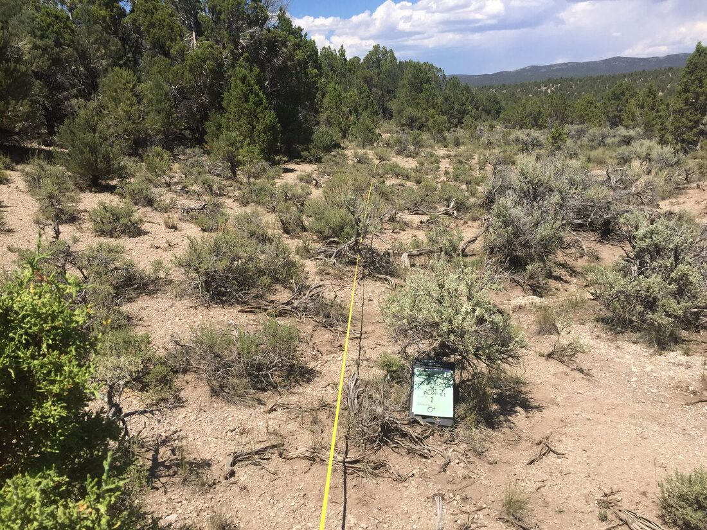
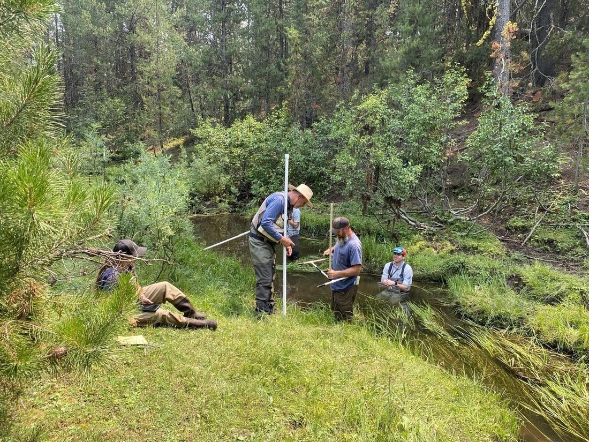
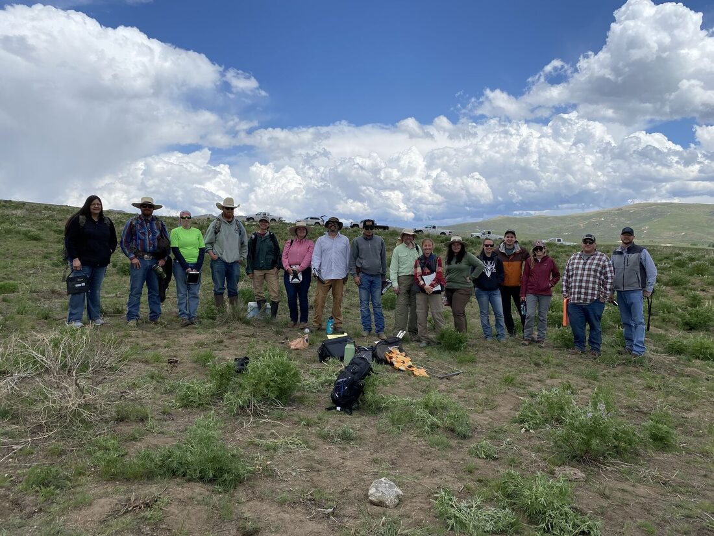

```{=html}
<section class="hero">
  <div class="hero-circuit" aria-hidden="true">
    <svg class="circuit-side circuit-left" viewBox="0 0 200 300" preserveAspectRatio="xMidYMax meet" fill="none">
      <path class="trace rail" pathLength="1" d="M34 268 H182"/>
      <path class="trace rail flow" pathLength="1" d="M34 268 H182"/>
      <g class="sag">
        <path class="trace" pathLength="1" d="M58 268 V152"/>
        <path class="trace" pathLength="1" d="M58 202 H86 V166"/>
        <path class="trace flow" pathLength="1" d="M58 268 V152"/>
        <path class="trace flow" pathLength="1" d="M58 202 H86 V166"/>
        <circle class="node" cx="58" cy="152" r="5"/>
        <circle class="node" cx="86" cy="166" r="4.5"/>
        <circle class="node base" cx="58" cy="268" r="3.5"/>
      </g>
      <g class="sag">
        <path class="trace" pathLength="1" d="M138 268 V56"/>
        <path class="trace" pathLength="1" d="M138 164 H104 V108"/>
        <path class="trace" pathLength="1" d="M138 126 H174 V80"/>
        <path class="trace flow" pathLength="1" d="M138 268 V56"/>
        <path class="trace flow" pathLength="1" d="M138 164 H104 V108"/>
        <path class="trace flow" pathLength="1" d="M138 126 H174 V80"/>
        <circle class="node" cx="138" cy="56" r="5.5"/>
        <circle class="node" cx="104" cy="108" r="4.5"/>
        <circle class="node" cx="174" cy="80" r="4.5"/>
        <circle class="node base" cx="138" cy="268" r="3.5"/>
      </g>
    </svg>
    <svg class="circuit-side circuit-right" viewBox="0 0 200 300" preserveAspectRatio="xMidYMax meet" fill="none">
      <path class="trace rail" pathLength="1" d="M34 268 H182"/>
      <path class="trace rail flow" pathLength="1" d="M34 268 H182"/>
      <g class="sag">
        <path class="trace" pathLength="1" d="M58 268 V152"/>
        <path class="trace" pathLength="1" d="M58 202 H86 V166"/>
        <path class="trace flow" pathLength="1" d="M58 268 V152"/>
        <path class="trace flow" pathLength="1" d="M58 202 H86 V166"/>
        <circle class="node" cx="58" cy="152" r="5"/>
        <circle class="node" cx="86" cy="166" r="4.5"/>
        <circle class="node base" cx="58" cy="268" r="3.5"/>
      </g>
      <g class="sag">
        <path class="trace" pathLength="1" d="M138 268 V56"/>
        <path class="trace" pathLength="1" d="M138 164 H104 V108"/>
        <path class="trace" pathLength="1" d="M138 126 H174 V80"/>
        <path class="trace flow" pathLength="1" d="M138 268 V56"/>
        <path class="trace flow" pathLength="1" d="M138 164 H104 V108"/>
        <path class="trace flow" pathLength="1" d="M138 126 H174 V80"/>
        <circle class="node" cx="138" cy="56" r="5.5"/>
        <circle class="node" cx="104" cy="108" r="4.5"/>
        <circle class="node" cx="174" cy="80" r="4.5"/>
        <circle class="node base" cx="138" cy="268" r="3.5"/>
      </g>
    </svg>
  </div>
  <span class="eyebrow">Data Scientist · Ecologist</span>
  <div class="hero-avatar">
    <div class="avatar-card">
      
      <span class="holo" aria-hidden="true"></span>
      <span class="holo-glare" aria-hidden="true"></span>
    </div>
  </div>
  <h1>Timothy <span class="accent">Gilbert</span></h1>
  <p class="lede">I build R&nbsp;Shiny apps, relational databases, and custom data workflows for environmental consultants, university labs, and small businesses. Ecologist by training, data engineer by trade.</p>
  <div class="cta-row">
    <a class="tg-btn tg-btn-primary" href="dashboards.qmd">Explore my apps</a>
    <a class="tg-btn tg-btn-salmon" href="ecoplot.qmd">EcoPlot</a>
    <a class="tg-btn tg-btn-ghost" href="field-notes.qmd">Flora Wall</a>
    <a class="tg-btn tg-btn-ghost" href="https://desertdatalabs.com/" target="_blank" rel="noopener">Desert Data Labs ↗</a>
  </div>
</section>
```

::: {.tg-section style="padding-top:1rem;"}
Welcome to my digital portfolio. I'm a data scientist and ecologist specializing in R Shiny applications, relational databases, and custom data workflows. I hold a B.S. in Natural Resources and am completing my M.S. in Data Science at the University of Arizona. I also run [**Desert Data Labs LLC**](https://desertdatalabs.com/) — a small consulting studio that builds data-collection apps, dashboards, and automation tools for environmental consultants, university labs, and small businesses.

::: {.card-container .reveal .stagger}
<a></a>
<a href="about.qmd" class="card card-about">ABOUT ME</a>
<a href="dashboards.qmd" class="card card-visualizations">SHINY APPS</a>
<a href="projects.qmd" class="card card-projects">PROJECTS</a>
<a href="resume.qmd" class="card card-resume">RESUME/CV</a>
:::

::: {.explore-text .reveal}
## Fun things I love to work on…

-   *Sports analytics and data visualization*
-   *Data-entry applications with a SQL back-end (local and web-hosted)*
-   *Ecological data management and visualization*
-   *Custom web-scraping interactive tools*
-   *Machine learning for forecasting*
-   *Using Claude to re-vamp old codebases and automate tedious tasks*
:::
:::

::: {.tg-section .reveal}
```{=html}
<section class="field-parallax">
  <div class="fp-viewport"></div>
  <div class="fp-overlay">
    <span class="eyebrow">From the field</span>
    <h2>The work behind the data</h2>
    <p>Experiences that taught me a lot about data collecting.</p>
    <a class="tg-btn tg-btn-primary" href="field-notes.qmd">Go to flora wall →</a>
  </div>
</section>

<div class="field-grid" style="margin-top:1rem;">
  <figure class="field-shot"><figcaption>LPI transect data for GBI</figcaption></figure>
  <figure class="field-shot"><figcaption>Soil surveys for NEON</figcaption></figure>
  <figure class="field-shot"><figcaption>MIMs sampling for USFS</figcaption></figure>
  <figure class="field-shot"><figcaption>Field training for VGS</figcaption></figure>
</div>
```
:::

::: {.tg-section .reveal}
::: section-label
Design & motion
:::

```{=html}
<div class="sprout-section">
  <div class="sprout-copy">
    <h3>Design &amp; motion, too</h3>
    <p>Not just dashboards! Making animations is fun too... <em>Hover or tap it to watch it grow.</em></p>
  </div>
  <div class="sprout-stage">
    <span class="sprout-kicker">Brand mark · SVG + CSS</span>
    <button class="logo" type="button" aria-label="Sprout logo — a seedling that grows when you hover or focus it">
      <svg viewBox="0 0 240 240" xmlns="http://www.w3.org/2000/svg" xmlns:xlink="http://www.w3.org/1999/xlink">
        <defs>
          <g id="leaf">
            <path d="M0 0 C 9 -13 26 -16 38 -3 C 30 6 14 12 0 0 Z" fill="var(--leaf)"/>
            <path d="M2 -1 C 13 -5 23 -6 33 -4" fill="none" stroke="#2a4f33" stroke-width="1.3" stroke-linecap="round" opacity=".5"/>
          </g>
          <radialGradient id="discFill" cx="50%" cy="38%" r="70%">
            <stop offset="0%" stop-color="#fbf7ec"/>
            <stop offset="70%" stop-color="#efe7d4"/>
            <stop offset="100%" stop-color="#e4d8bd"/>
          </radialGradient>
        </defs>
        <g stroke-linejoin="round">
          <g class="v1">
            <path class="stem" pathLength="1" d="M120 150 C 78.1 120.0 43.6 117.4 26.8 93.7"/>
            <g class="sprout-leaf"><use href="#leaf" xlink:href="#leaf" transform="translate(50.5 112.9) rotate(-196.9) scale(0.92)"/></g>
            <g class="sprout-leaf"><use href="#leaf" xlink:href="#leaf" transform="translate(33.6 101.4) rotate(-147.3) scale(0.74)"/></g>
            <circle class="tip" cx="26.8" cy="93.7" r="5" fill="var(--sun)"/>
          </g>
          <g class="v2">
            <path class="stem" pathLength="1" d="M120 150 C 89.4 120.0 64.2 94.0 51.9 53.5"/>
            <g class="sprout-leaf"><use href="#leaf" xlink:href="#leaf" transform="translate(63.4 81.5) rotate(-169.1) scale(0.92)"/></g>
            <g class="sprout-leaf"><use href="#leaf" xlink:href="#leaf" transform="translate(56.9 67.5) rotate(-120.2) scale(0.74)"/></g>
            <circle class="tip" cx="51.9" cy="53.5" r="5" fill="var(--leaf-2)"/>
          </g>
          <g class="v3">
            <path class="stem" pathLength="1" d="M120 150 C 108.6 120.0 99.2 80.0 94.6 29.3"/>
            <g class="sprout-leaf"><use href="#leaf" xlink:href="#leaf" transform="translate(97.9 58.5) rotate(-134.6) scale(0.92)"/></g>
            <g class="sprout-leaf"><use href="#leaf" xlink:href="#leaf" transform="translate(96.5 47.1) rotate(-89.0) scale(0.74)"/></g>
            <circle class="tip" cx="94.6" cy="29.3" r="5" fill="var(--sun)"/>
          </g>
          <g class="v4">
            <path class="stem" pathLength="1" d="M120 150 C 131.4 120.0 140.8 80.0 145.4 29.3"/>
            <g class="sprout-leaf"><use href="#leaf" xlink:href="#leaf" transform="translate(142.1 58.5) rotate(-97.4) scale(0.92)"/></g>
            <g class="sprout-leaf"><use href="#leaf" xlink:href="#leaf" transform="translate(143.5 47.1) rotate(-55.0) scale(0.74)"/></g>
            <circle class="tip" cx="145.4" cy="29.3" r="5" fill="var(--leaf-2)"/>
          </g>
          <g class="v5">
            <path class="stem" pathLength="1" d="M120 150 C 150.6 120.0 175.8 94.0 188.1 53.5"/>
            <g class="sprout-leaf"><use href="#leaf" xlink:href="#leaf" transform="translate(176.6 81.5) rotate(-62.9) scale(0.92)"/></g>
            <g class="sprout-leaf"><use href="#leaf" xlink:href="#leaf" transform="translate(183.1 67.5) rotate(-23.8) scale(0.74)"/></g>
            <circle class="tip" cx="188.1" cy="53.5" r="5" fill="var(--sun)"/>
          </g>
          <g class="v6">
            <path class="stem" pathLength="1" d="M120 150 C 161.9 120.0 196.4 117.4 213.2 93.7"/>
            <g class="sprout-leaf"><use href="#leaf" xlink:href="#leaf" transform="translate(189.5 112.9) rotate(-35.1) scale(0.92)"/></g>
            <g class="sprout-leaf"><use href="#leaf" xlink:href="#leaf" transform="translate(206.4 101.4) rotate(3.3) scale(0.74)"/></g>
            <circle class="tip" cx="213.2" cy="93.7" r="5" fill="var(--leaf-2)"/>
          </g>
        </g>
        <g class="disc">
          <circle cx="120" cy="124" r="54" fill="url(#discFill)" stroke="#d8cbac" stroke-width="2"/>
          <circle cx="120" cy="124" r="46" fill="none" stroke="#cdbf9d" stroke-width="1" opacity=".6"/>
          <path d="M96 150 Q120 164 144 150 Q120 176 96 150 Z" fill="#caa86f" opacity=".55"/>
          <ellipse cx="120" cy="148" rx="8" ry="6" fill="var(--seed)"/>
          <path d="M120 148 C 120 135 120 121 120 107" fill="none" stroke="var(--moss)" stroke-width="5" stroke-linecap="round"/>
          <g class="core-leaf l"><path d="M120 130 C 107 123 97 110 99 95 C 112 99 121 113 120 130 Z" fill="var(--leaf)"/></g>
          <g class="core-leaf r"><path d="M120 127 C 133 118 142 105 140 91 C 127 95 118 110 120 127 Z" fill="var(--leaf-2)"/></g>
          <circle cx="120" cy="93" r="4" fill="var(--sun)"/>
        </g>
      </svg>
    </button>
    <div class="sprout-word">Spr<em>ou</em>t</div>
    <div class="sprout-tag">grow what you love</div>
  </div>
</div>
```
:::

::: {.tg-section .reveal}
::: section-label
Fun data visualizations
:::

::: {.viz-figs .reveal .stagger}
### Big 12 Recruiting — Distance Traveled by Recruits

![This box plot examines how far football recruits travel to join Big 12 football programs and whether that distance changed in the most recent recruiting cycle. Each symbol represents the distance a recruit traveled from their high school to their college (indicated by the logos on the left). Circles represent recruits for the 2025 season, while x symbols represent recruits that have been targeted from earlier classes (2016- 2024 ). The plot is ordered from top to bottom by smallest median distance (thick black line in each box plot). Twenty-eight extreme outliers (\~%1 of data) were excluded for clarity. Texas schools tend to draw recruits from shorter distances and have relatively low medians: Baylor(163 miles), Houston(179 miles) and TCU(221 miles). BYU, Arizona, Arizona State and Utah have higher medians ranging from 350-600 miles, largely driven by recruits from Hawaii. Overall, recruiting distance patterns appear relatively stable over time, with the 2025 class showing similar distance traveled to previous years. The one notable exception being UCF, which had no recruits from California in 2025.](assets/distance.png){.lightboxable}

### Big 12 Recruiting over Time (Table)

![These tables summarize how recruiting talent has changed over time by region and position group. Players were assigned to regions based on the state where they attended high school. Recruits from outside the United States, as well as those who did not fall into selected position groups were excluded for clarity. Table A uses average player scores to assess how talent has changed over time. All regions showed increases in average scores for both position groups as seen by the darker colors in the more recent years. The Northeast recorded the highest average score in 2025 (89.3 ), although this reflects only three rated recruits for that year. Table B uses total counts of rated players to show talent changes in volume over time. The year 2025 was excluded because it does not represent a full three-year grouping. The Southwest and West had the most rated recruits (993 and 750 respectively) followed by the Southeast (616 ), Midwest (544 ) and Northeast (98 ). Overall, the number of rated recruits has declined over time while average ratings have increased which could be due to more selective recruiting and/or changes in how players have been rated over time.](assets/table.png){.lightboxable}

### Solar Power Generation Change over Time

![This faceted bar plot shows how total solar power generation has changed over the last six years. The year 2019 was chosen as the starting point because it marks the period when solar generation began increasing substantially. From 2019 to 2024, solar power generation rose across all selected countries, the largest being China, which increased from 224 TWh in 2019 to 839 TWh in 2024 (a 247% increase). In contrast, the second largest producer, the United States, increased from 107 TWh to 303 TWh over the same period (a 183% increase). The only change in ranking occurred in 2022 when India overtake Japan to become the third largest solar power generating country. Overall, total solar power generation has increased steadily over time.](assets/solar.png){.lightboxable}

:::
:::

::: {.tg-section .reveal}
## Contact Me

```{=html}
<div class="contact-container">
  <a href="mailto:tsgilbert@arizona.edu" class="contact email"><svg class="ico" viewBox="0 0 24 24" width="18" height="18" fill="none" stroke="currentColor" stroke-width="2" stroke-linecap="round" stroke-linejoin="round"><rect x="2" y="4" width="20" height="16" rx="2"/><path d="m22 7-8.97 5.7a1.94 1.94 0 0 1-2.06 0L2 7"/></svg>Email me</a>
  <a href="https://github.com/tgilbert14" class="contact git"><svg class="ico" viewBox="0 0 24 24" width="18" height="18" fill="none" stroke="currentColor" stroke-width="2" stroke-linecap="round" stroke-linejoin="round"><path d="M15 22v-4a4.8 4.8 0 0 0-1-3.5c3 0 6-2 6-5.5.08-1.25-.27-2.48-1-3.5.28-1.15.28-2.35 0-3.5 0 0-1 0-3 1.5-2.64-.5-5.36-.5-8 0C6 2 5 2 5 2c-.3 1.15-.3 2.35 0 3.5A5.4 5.4 0 0 0 4 9c0 3.5 3 5.5 6 5.5-.39.49-.68 1.05-.85 1.65-.17.6-.22 1.23-.15 1.85v4"/><path d="M9 18c-4.51 2-5-2-7-2"/></svg>My GitHub</a>
  <a href="https://www.buymeacoffee.com/tgilbert14" class="contact coffee"><svg class="ico" viewBox="0 0 24 24" width="18" height="18" fill="none" stroke="currentColor" stroke-width="2" stroke-linecap="round" stroke-linejoin="round"><path d="M10 2v2"/><path d="M14 2v2"/><path d="M16 8a1 1 0 0 1 1 1v8a4 4 0 0 1-4 4H7a4 4 0 0 1-4-4V9a1 1 0 0 1 1-1h14a4 4 0 1 1 0 8h-1"/><path d="M6 2v2"/></svg>Buy me a coffee</a>
</div>
```
:::
