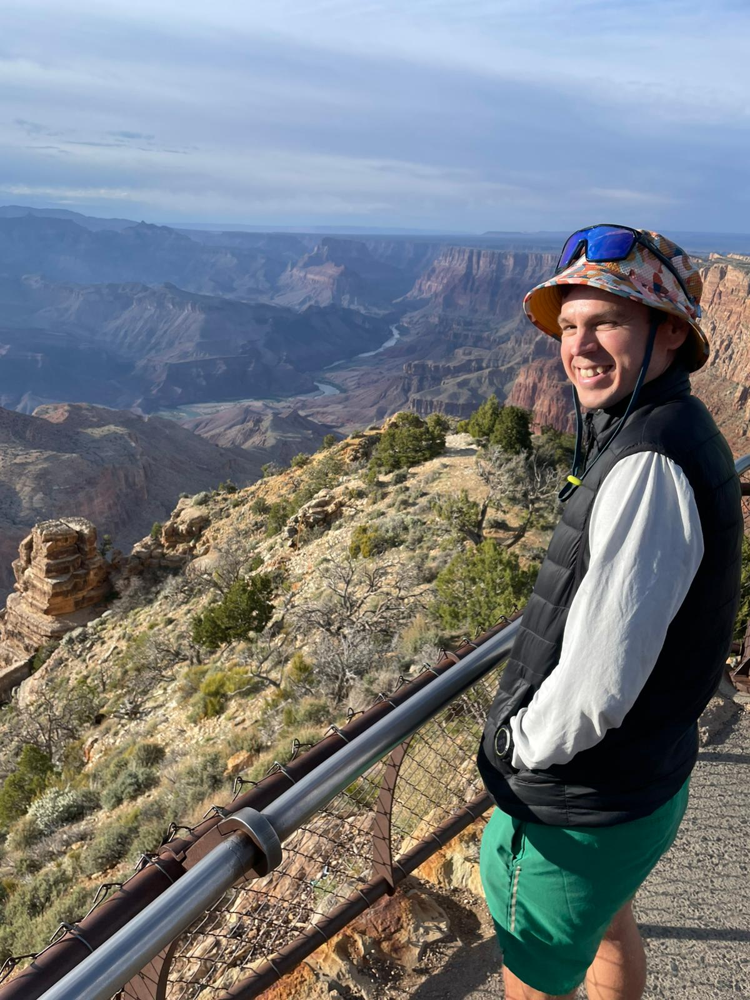
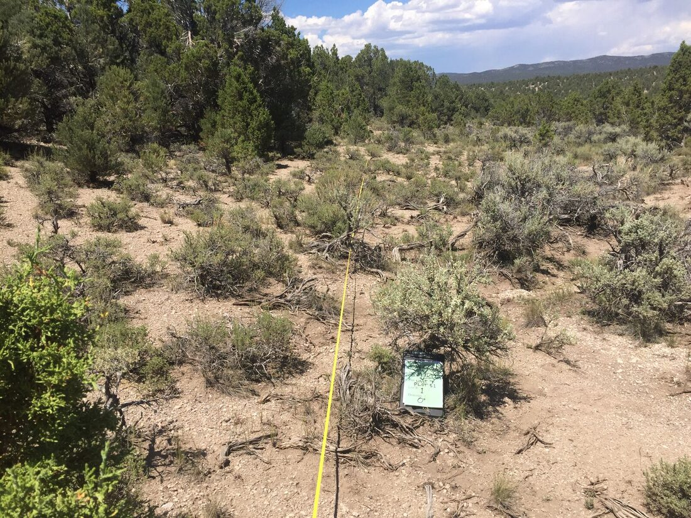
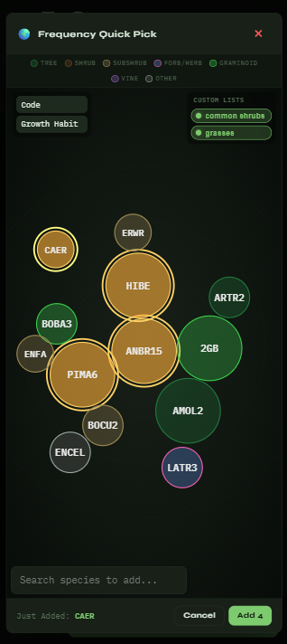
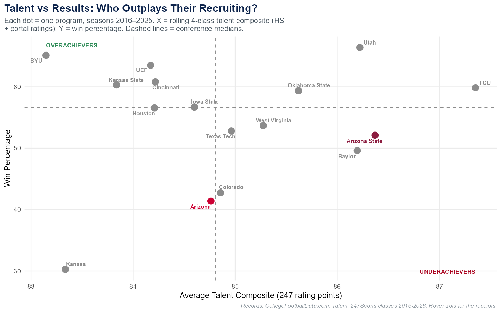
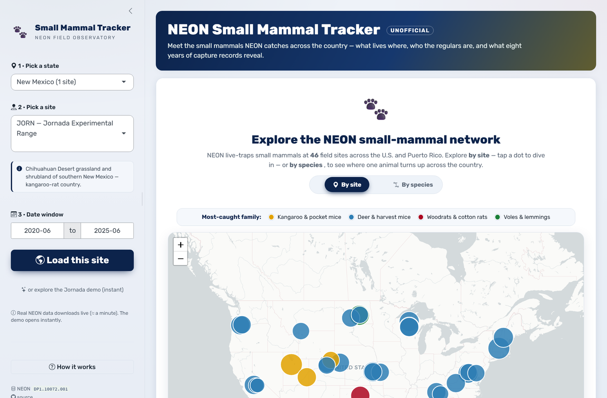
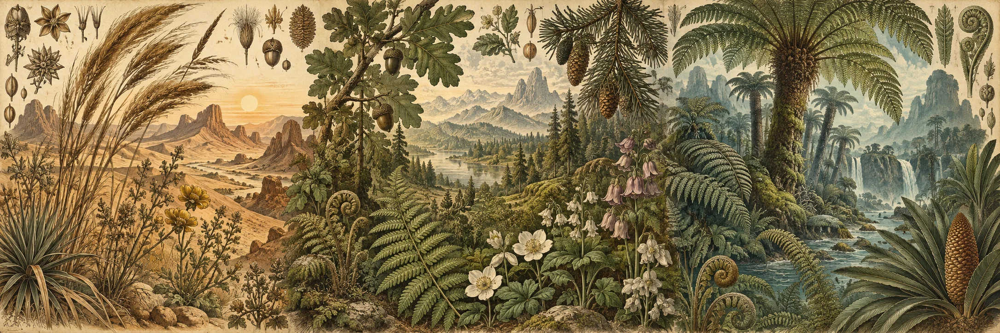
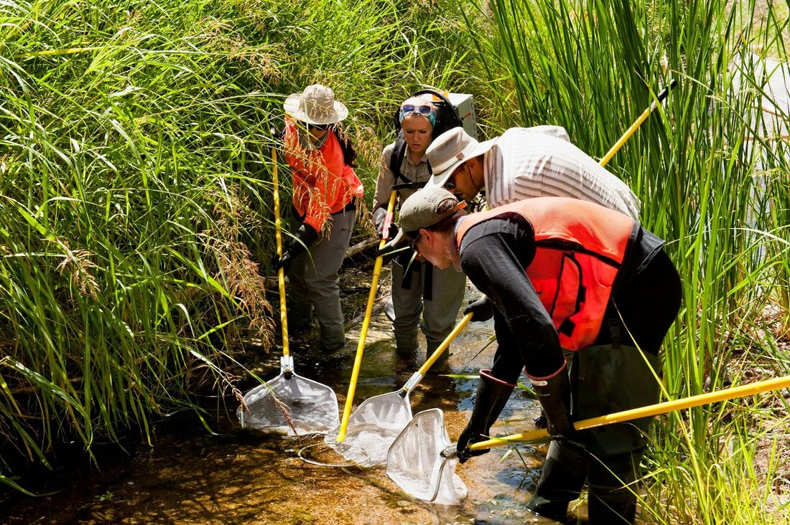

```{=html}
<div class="portfolio-home portfolio-home--wild">
  <section class="portfolio-hero portfolio-hero--wild" aria-labelledby="hero-title" data-wild-hero>
    <div class="hero-grid" aria-hidden="true"></div>
    <div class="portfolio-hero__copy">
      <p class="signal-label"><span></span> Tim Gilbert / Tucson, Arizona</p>
      <h1 id="hero-title">Apps for ecologists, sports fans &amp; <em>nerds.</em></h1>
      <p class="portfolio-hero__lede">I’m an ecologist and data scientist who builds R Shiny apps, databases, scrapers, offline field tools, and interactive browser experiences. I like making complicated things easier to use, and a lot more fun.</p>
      <div class="portfolio-actions">
        <a class="tg-btn tg-btn-primary" href="#interactive-web">Start with the fun stuff <span aria-hidden="true">↓</span></a>
        <a class="tg-btn tg-btn-ghost" href="#apps-and-systems">Apps &amp; systems</a>
      </div>
      <div class="hero-signoff">
        <span>Ecologist</span><i aria-hidden="true">+</i><span>Data scientist</span><i aria-hidden="true">+</i><span>Builder of odd little worlds</span>
      </div>
    </div>

    <div class="hero-self-portrait" data-tilt-card data-portrait-morph>
      <p class="portrait-kicker"><span></span> Field identification / TG-14</p>
      <div class="hero-self-portrait__frame">
        
        
        <div class="portrait-holo-gate" aria-hidden="true"><i></i><i></i><i></i></div>
        <span class="portrait-coordinate">36.10° N / 112.11° W</span>
        <span class="portrait-status"><i aria-hidden="true"></i><span class="portrait-status__real">FIELD RECORD ACTIVE</span><span class="portrait-status__dog">CANIS MODE ACTIVE</span></span>
        <button class="portrait-toggle" type="button" aria-pressed="false" aria-label="Toggle alternate dog portrait" data-portrait-toggle><span>ALT SPECIMEN</span><i aria-hidden="true">↻</i></button>
      </div>
      <div class="hero-self-portrait__caption">
        <div><small>SUBJECT</small><strong>Tim Gilbert</strong></div>
        <div><small>RANGE</small><strong>Mostly Arizona</strong></div>
      </div>
      <span class="portrait-chip portrait-chip--r" aria-hidden="true">R</span>
      <span class="portrait-chip portrait-chip--sql" aria-hidden="true">SQL</span>
      <span class="portrait-chip portrait-chip--field" aria-hidden="true">FIELD</span>
    </div>
  </section>

  <div class="build-ticker" aria-label="Tools and subjects I work with">
    <div class="build-ticker__track">
      <span>R SHINY</span><i>✶</i><span>PYTHON</span><i>✶</i><span>SQL</span><i>✶</i><span>CANVAS</span><i>✶</i><span>FIELD ECOLOGY</span><i>✶</i><span>SPORTS DATA</span><i>✶</i><span>OFFLINE-FIRST</span><i>✶</i><span>WEIRD SIDE PROJECTS</span><i>✶</i>
      <span aria-hidden="true">R SHINY</span><i aria-hidden="true">✶</i><span aria-hidden="true">PYTHON</span><i aria-hidden="true">✶</i><span aria-hidden="true">SQL</span><i aria-hidden="true">✶</i><span aria-hidden="true">CANVAS</span><i aria-hidden="true">✶</i><span aria-hidden="true">FIELD ECOLOGY</span><i aria-hidden="true">✶</i><span aria-hidden="true">SPORTS DATA</span><i aria-hidden="true">✶</i><span aria-hidden="true">OFFLINE-FIRST</span><i aria-hidden="true">✶</i><span aria-hidden="true">WEIRD SIDE PROJECTS</span><i aria-hidden="true">✶</i>
    </div>
  </div>

  <section class="portfolio-section interactive-web interactive-web--lead" id="interactive-web">
    <div class="section-heading reveal">
      <div><p class="signal-label"><span></span> Interactive web</p><h2>A field plot to peel. A storm to compare.</h2></div>
      <p>Explore ecological records and a paired storm model. Keep going for a Tucson Saturday, a mountain road, and a dead spaceship.</p>
    </div>
    <div class="web-project-grid web-project-grid--loud web-project-grid--experiences">
      <a class="web-project web-project--study reveal" href="https://desertdatalabs.com/experiences/living-x-ray/" target="_blank" rel="noopener" data-reactive-card>
        <div class="web-project__image"></div>
        <div class="web-project__copy"><p>Living X-Ray</p><h3>Peel back a Santa Rita research plot.</h3><p class="web-project__note">Native NEON terrain, aerial and canopy layers, and 179 tagged plant records. Select a plant to inspect its source measurements and model defaults.</p><small>Measured terrain · modeled plants · source receipts</small><b>Explore the plot ↗</b></div>
      </a>
      <a class="web-project web-project--study reveal" href="https://desertdatalabs.com/experiences/two-futures/" target="_blank" rel="noopener" data-reactive-card>
        <div class="web-project__image"></div>
        <div class="web-project__copy"><p>Two Futures</p><h3>What changes when you dig one basin?</h3><p class="web-project__note">Run two copies of the actual Storm Table model on one clock. Inspect the first sustained difference and save the paired view, ledgers, and recipe.</p><small>Time-compressed, uncalibrated exhibit. Not a site forecast.</small><b>Compare the storm ↗</b></div>
      </a>
      <a class="web-project reveal" href="https://tgilbert14.github.io/old-pueblo/" target="_blank" rel="noopener" data-reactive-card>
        <div class="web-project__image"><span>Scroll + sound</span></div>
        <div class="web-project__copy"><p>The Long Saturday</p><h3>One desert day, from first light to kickoff.</h3><small>Film scrubbing · field-recorded soundscape · four scroll movements</small><b>Enter the story ↗</b></div>
      </a>
      <a class="web-project reveal" href="https://tgilbert14.github.io/ddl-27-miles/" target="_blank" rel="noopener" data-reactive-card>
        <div class="web-project__image"><span>Procedural Canvas</span></div>
        <div class="web-project__copy"><p>27 Miles to Canada</p><h3>Drive from saguaros to snow in twenty-seven miles.</h3><small>Six biotic communities · elevation model · live climate shift</small><b>Start the climb ↗</b></div>
      </a>
      <a class="web-project reveal" href="https://tgilbert14.github.io/ddl-orrery/" target="_blank" rel="noopener" data-reactive-card>
        <div class="web-project__image"><span>Procedural world</span></div>
        <div class="web-project__copy"><p>The Orrery</p><h3>Eleven worlds keep time around one dead ship.</h3><small>Canvas-baked planets · generative score · shuttle flight · hidden sector</small><b>Choose a world ↗</b></div>
      </a>
    </div>
    <article class="demolition-console reveal" aria-labelledby="demolition-title" data-demolition-console>
      <button class="demolition-target" type="button" disabled aria-label="Miniature target illustration" data-demolition-test>
        <span class="demolition-target__label">Miniature target</span>
        <svg viewBox="0 0 300 184" fill="none" aria-hidden="true">
          <defs><pattern id="demolition-grid" width="20" height="20" patternUnits="userSpaceOnUse"><path d="M20 0H0V20" stroke="currentColor" stroke-opacity=".13"/></pattern></defs>
          <path fill="url(#demolition-grid)" d="M0 0h300v184H0z"/>
          <g class="demolition-target__page">
            <path d="m65 40 147-13 24 113-147 13z" fill="currentColor" fill-opacity=".07" stroke="currentColor" stroke-opacity=".55"/>
            <path d="m65 40 147-13 4 18-147 13z" fill="currentColor" fill-opacity=".13"/>
            <path d="m80 44 3-.3m6-.5 3-.3m6-.5 3-.3M80 76l67-6m-65 17 47-4" stroke="currentColor" stroke-width="3" stroke-linecap="round"/>
            <path d="m85 104 40-4 6 29-40 4zm51-5 40-4 6 29-40 4zm51-4 24-2 6 29-24 2z" fill="currentColor" fill-opacity=".16"/>
            <path d="m162 66 42-4 3 17-42 4z" fill="currentColor" fill-opacity=".25"/>
          </g>
          <g class="demolition-target__sight"><circle cx="150" cy="91" r="36" stroke="currentColor" stroke-width="1.2"/><path d="M150 42v23m0 52v23M101 91h23m52 0h23" stroke="currentColor" stroke-width="1.5"/><circle cx="150" cy="91" r="3" fill="currentColor"/></g>
          <g class="demolition-target__hit"><circle cx="150" cy="91" r="13" stroke="currentColor" stroke-width="2"/><path d="m125 74-9-8m60 12 10-5m-36-18v-9m-18 67-6 9m40-8 5 9" stroke="currentColor" stroke-width="2" stroke-linecap="round"/></g>
          <path d="M18 44V18h26m212 0h26v26M18 140v26h26m212 0h26v-26" stroke="currentColor" stroke-opacity=".35"/>
        </svg>
        <span class="demolition-target__caption"><span data-demolition-test-label>Preview only</span><span aria-hidden="true">＋</span></span>
      </button>
      <div class="demolition-copy">
        <p class="demolition-kicker">One more way to explore</p>
        <h3 id="demolition-title">Take a shot at my portfolio.</h3>
        <p>Play with a copy of this page in Sprite Fusion.</p>
        <small>A game by Hugo Duprez / <a href="https://www.spritefusion.com/games/destroy-any-website" target="_blank" rel="noopener noreferrer">Sprite Fusion ↗</a></small>
      </div>
      <div class="demolition-launch-panel">
        <a class="demolition-launch" href="https://destroy.spritefusion.com/?from=badge&amp;url=https%3A%2F%2Ftgilbert14.github.io%2Ftimothy-gilbert-portfolio%2F" target="_blank" rel="noopener noreferrer" aria-label="Launch Destroy Any Website on Sprite Fusion in a new tab" data-demolition-launch><span>Launch game <span aria-hidden="true">↗</span></span></a>
        <p>Mouse or touch to aim.<br>Phone: landscape. Esc pauses.</p>
      </div>
    </article>
  </section>

  <section class="portfolio-section apps-section" id="apps-and-systems">
    <div class="section-heading reveal">
      <div><p class="signal-label"><span></span> Apps + systems</p><h2>Field tools and data products.</h2></div>
      <p>Offline collection, roster analysis, capture histories, and plant-family comparisons.</p>
    </div>

    <div class="app-grid">
      <article class="app-card app-card--ecoplot reveal" data-reactive-card>
        <div class="app-card__image app-card__image--ecoplot">
          
          <div class="ecoplot-status"><i aria-hidden="true"></i><span>OFFLINE · 12 SAFE</span></div>
          <div class="ecoplot-device" aria-hidden="true"><i></i></div>
          <div class="ecoplot-route" aria-hidden="true"><i></i><i></i><i></i></div>
          <div class="ecoplot-database" aria-hidden="true"><i></i><i></i><i></i><b>SQL</b></div>
          <span>01 / FIELD → DATABASE</span>
        </div>
        <div class="app-card__copy"><h3>EcoPlot Mobile</h3><p>Offline vegetation data collection, cloud sync, office review, and reports. Built for places where the bars on your phone are mostly decorative.</p><ul class="tech-list"><li>PWA</li><li>Azure SQL</li><li>Offline sync</li></ul><div class="case-links"><a href="ecoplot.qmd">Case study →</a><a href="https://app.desertdatacollection.com/" target="_blank" rel="noopener">Live app ↗</a></div></div>
      </article>

      <article class="app-card reveal" data-reactive-card>
        <div class="app-card__image"><span>02 / SPORTS</span></div>
        <div class="app-card__copy"><h3>Power-4 Girth Index</h3><p>Compare how all 67 ACC, Big Ten, Big 12, and SEC programs build football and basketball rosters: body maps, position profiles, where the high-school talent actually comes from, and whether recruiting strength turns into wins. Yes, the name is intentional.</p><ul class="tech-list"><li>R Shiny</li><li>Live data</li><li>Power-4 matchups</li></ul><div class="case-links"><a href="https://girthindex.desertdatalab.com/" target="_blank" rel="noopener">Open app ↗</a></div></div>
      </article>

      <article class="app-card reveal" data-reactive-card>
        <div class="app-card__image"><span>03 / ECOLOGY</span></div>
        <div class="app-card__copy"><h3>Small Mammal Tracker</h3><p>National trapping records turned into animal histories, home ranges, diversity profiles, and a Hall of Fame for the most-caught little weirdos.</p><ul class="tech-list"><li>R</li><li>Mapping</li><li>Ecological stats</li></ul><div class="case-links"><a href="https://tgilbert14.github.io/NEON-Small-Mammal-Tracker-App/" target="_blank" rel="noopener">Open app ↗</a></div></div>
      </article>

      <article class="app-card reveal" data-reactive-card>
        <div class="app-card__image"><span>04 / BOTANY?</span></div>
        <div class="app-card__copy"><h3>Plants in Movies</h3><p>Explore Arrakis, Middle-earth and Isla Nublar through real plant records. Compare states, look closer with a specimen lens, and save your finds in a field notebook.</p><ul class="tech-list"><li>R Shiny</li><li>USDA data</li><li>Field notebook</li></ul><div class="case-links"><a href="https://019ecc91-3c6c-bee2-f824-0ea23fc60ac6.share.connect.posit.cloud/" target="_blank" rel="noopener">Open app ↗</a></div></div>
      </article>
    </div>

    <div class="section-end-link reveal"><a href="work.qmd">Everything else I’ve built <span aria-hidden="true">→</span></a></div>
  </section>

  <section class="portfolio-section proof-ledger reveal" aria-labelledby="proof-title">
    <div class="proof-ledger__head">
      <p class="signal-label"><span></span> A few receipts</p>
      <h2 id="proof-title">Real projects. Real records.</h2>
    </div>
    <div class="proof-ledger__grid">
      <article data-reactive-card><strong data-count-to="178" data-count-suffix="k+">178k+</strong><span>Capture records traced to individual animals</span></article>
      <article data-reactive-card><strong data-count-to="46">46</strong><span>NEON field sites in one tracker</span></article>
      <article data-reactive-card><strong data-count-to="3">3</strong><span>Movie worlds explored through USDA plant records</span></article>
    </div>
  </section>

  <section class="portfolio-section capabilities-section">
    <div class="section-heading reveal">
      <div><p class="signal-label"><span></span> Under the hood</p><h2>I do the database, the interface, and the field logic.</h2></div>
      <p>I’m happiest on the small, specific problems, like the offline edit that collided with someone else’s, or the trap tag that got reused. Nobody downstream should ever have to know it happened.</p>
    </div>
    <div class="capability-grid">
      <article class="capability-card reveal" data-reactive-card><span>01</span><h3>Build the thing</h3><p>R Shiny apps, progressive web apps, desktop helpers, and interactive browser work.</p><small>R · Python · JavaScript · Electron</small></article>
      <article class="capability-card reveal" data-reactive-card><span>02</span><h3>Wire the data</h3><p>Relational models, offline sync, ETL pipelines, scrapers, and QA/QC that survive real use.</p><small>SQL · Azure · SQLite · APIs</small></article>
      <article class="capability-card reveal" data-reactive-card><span>03</span><h3>Know the field</h3><p>I spent years on field crews running vegetation protocols. I know what they ask of a crew, and what it is like to enter it all on a tablet.</p><small>Vegetation · Wildlife · Spatial data</small></article>
      <article class="capability-card reveal" data-reactive-card><span>04</span><h3>The fun part</h3><p>Maps, charts, motion, and sound. A chart you can poke at (tap a bar, see which families drive the score) beats one you just look at.</p><small>Canvas · Plotly · ggplot2 · Audio</small></article>
    </div>
  </section>

  <section class="field-story field-story--wild reveal">
    <div class="field-story__image"></div>
    <div class="field-story__copy">
      <h2>Before the data</h2>
      <p>I was collecting data for NEON before I wrote any code to handle it.</p>
      <p>Small-mammal trapping, vegetation surveys, electrofishing, and soil work. That’s why I build for one thumb in bad lighting, with no signal.</p>
      <div><a class="tg-btn tg-btn-primary" href="about.qmd">The longer story</a><a class="tg-btn tg-btn-ghost" href="field-notes.qmd">Field notes</a></div>
    </div>
  </section>

  <section class="portfolio-cta portfolio-cta--wild reveal">
    <p class="signal-label"><span></span> Send me the weird one</p>
    <h2>Got a cursed spreadsheet, a strange dataset, or an app idea nobody else understands?</h2>
    <p>That is probably more interesting than a normal contact form.</p>
    <div class="portfolio-actions"><a class="tg-btn tg-btn-primary" href="mailto:tsgilbert@arizona.edu">Tell me about it</a><a class="tg-btn tg-btn-ghost" href="https://github.com/tgilbert14" target="_blank" rel="noopener">Browse the code ↗</a></div>
  </section>
</div>
<script src="revamp.js" defer></script>
<script src="assets/creative/demolition-launcher.js" defer></script>
```
