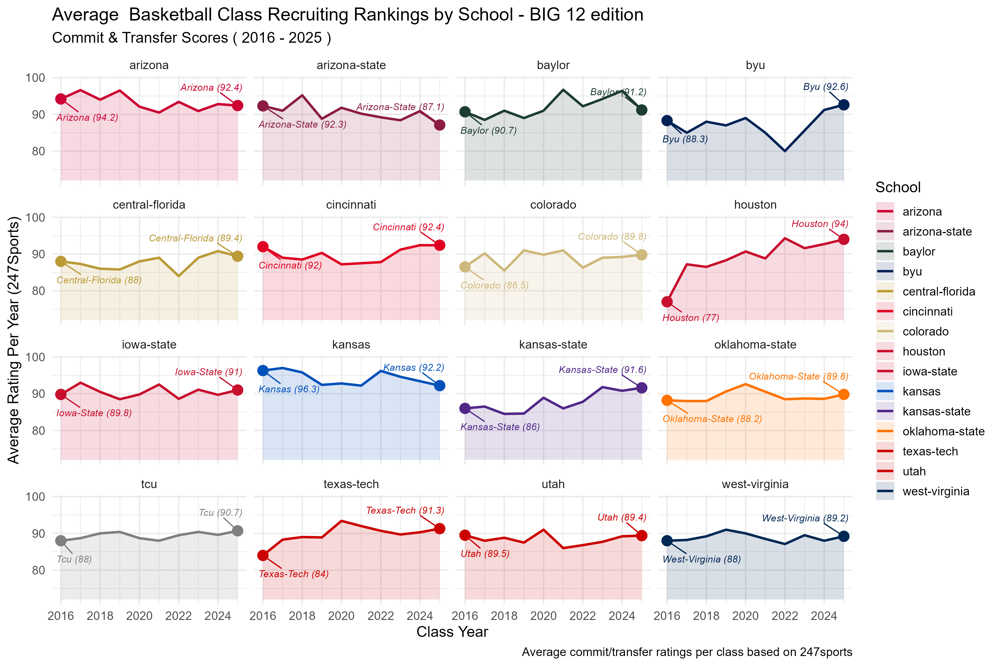
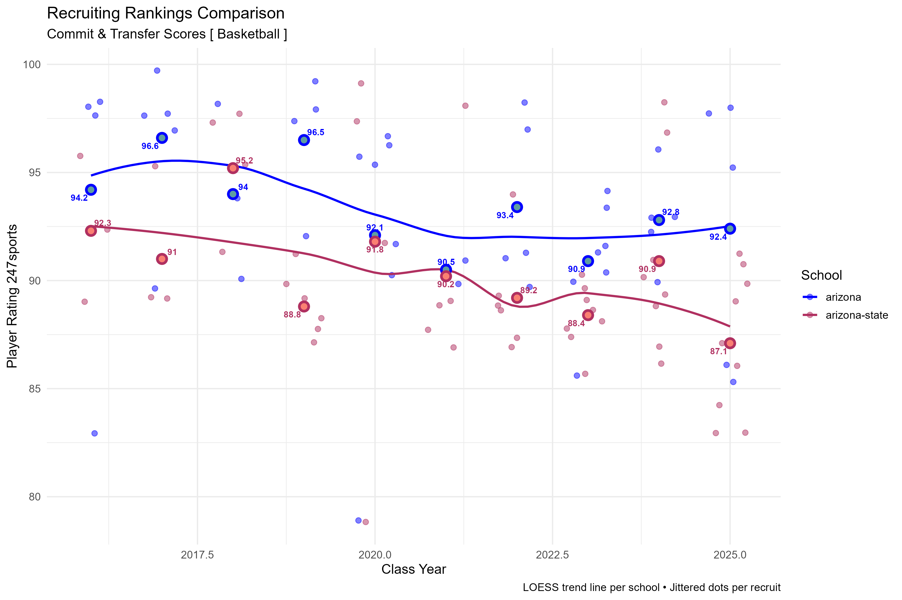
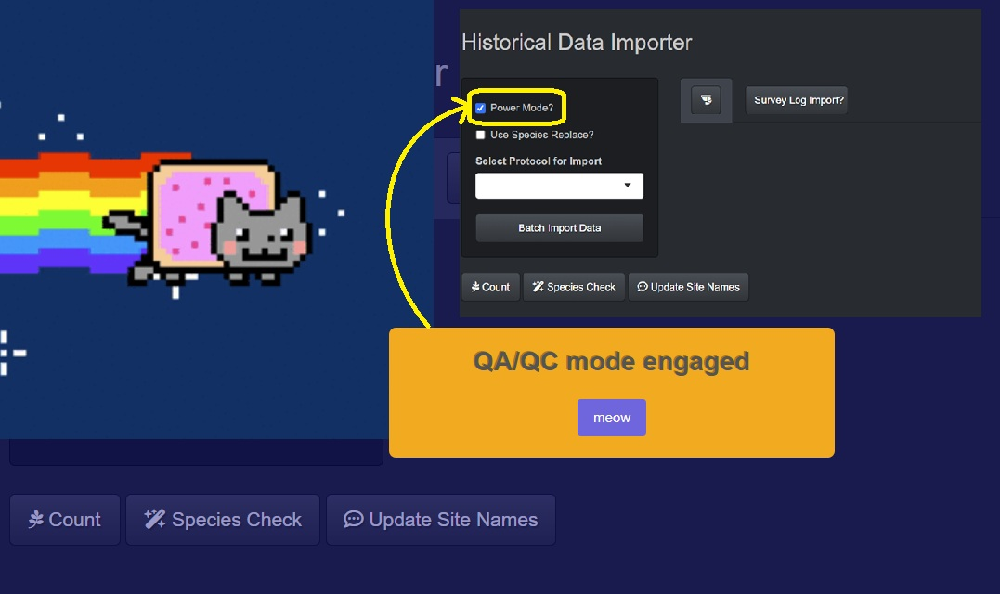
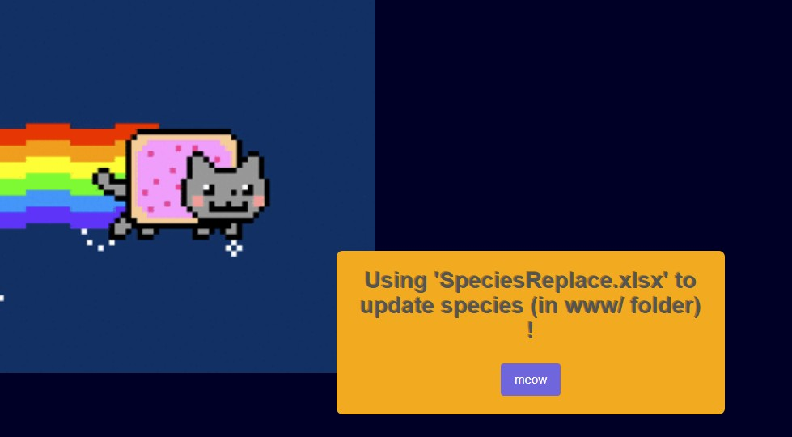
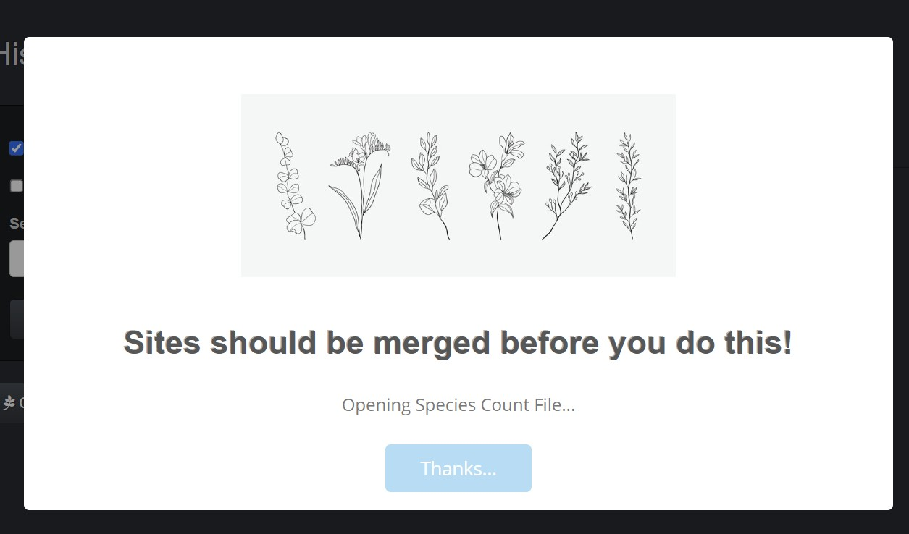
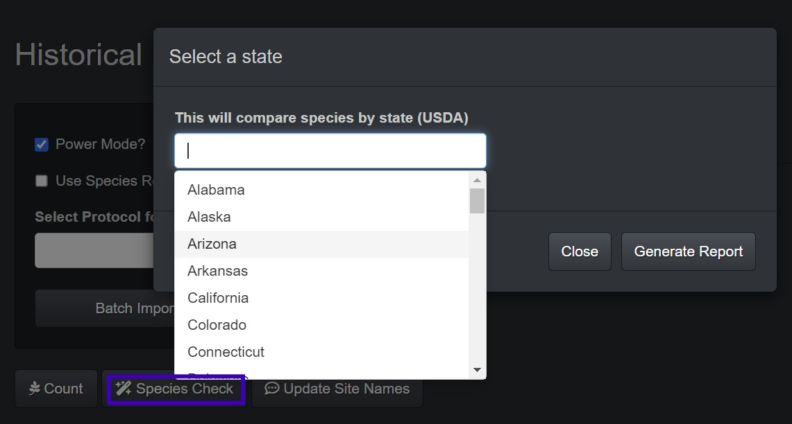
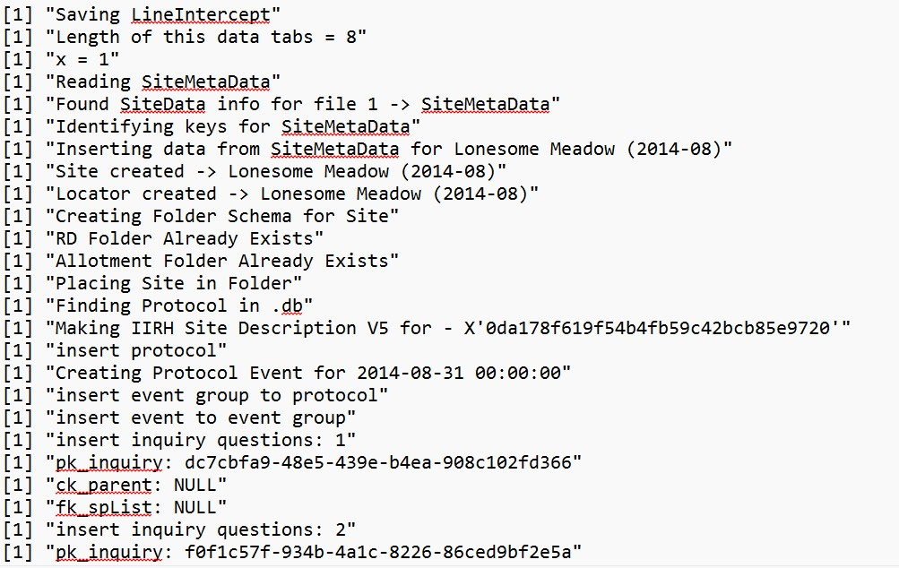

::: project-intro
Other Projects...
:::

::::: project-content

------------------------------------------------------------------------

::: {.reveal}

## *VGSLite*

An R-based helper application (.exe installer) built to support VGS 5 Desktop on Windows — written in R and packaged with Electron.

-   **Code:** [GitHub (Private)](https://github.com/tgilbert14/VGSLite "Please contact me if you would like to view source code")
-   **Live App:** Local-only

{.lightboxable}

Install guide, features &amp; usage

**⭆ Installation Guide**

1.  Download the latest release from [VGSLite](https://github.com/tgilbert14/VGSLite/releases/tag/VGSLite).
2.  Unzip the folder and run **VGSLite Setup.exe**.
3.  You may have to click "[*more info*]{.underline}" to install, as the app is not code-certified.

**⭆ Features**

✅ **Clean Database:** Cleans up orphan data links that may exist to help prevent corrupt data. Often used before "Empty Tombstone" to troubleshoot sync issues.

✅ **Convert database to Local:** Moves cloud data into local folders. Not recommended unless you plan on only collecting data locally.

✅ **Delete Unassigned data:** Deletes all data and sites inside the "Unassigned" bin at once instead of going through each event.

✅ **Empty Tombstone:** Clears the deletion cache, often used to troubleshoot sync issues.

✅ **Move Event:** Lets the user move a single event from one site to another — handy when an event was put on the wrong site. This WILL NOT UPDATE SYNC STATE (i.e., cloud-to-local or local-to-cloud).

**⭆ Usage**

✅ Select a task from the drop-down (e.g., "Move Event").

✅ Follow the prompts (e.g., select the site to move from, the site to move to, and the date of the event, then confirm).

✅ Click through the confirmation pop-ups to see what is being done.

✅ Close VGS 5 if it is open, then reopen it to confirm the changes.

:::

------------------------------------------------------------------------

::: {.reveal}

## NCAA Sample Data Visualizations

Scripts to scrape recruiting data from multiple sports sites (e.g., 247Sports, On3) and visualize Big 12 football and basketball class rankings over time. These scrapers now feed the live **Big 12 Girth Index** app.

-   **Code:** [GitHub](https://github.com/tgilbert14/UA-recruits-)
-   **Live app:** [Big 12 Girth Index](https://girthindex.desertdatalab.com/)

Sample visualizations

⭆ [Big 12 College Basketball Recruiting Class Grades, 2016–2025](https://github.com/tgilbert14/UA-recruits-/blob/main/plots/basketball/comparisons/basketball_avgClassRatings_ALL_2025-07-09.png)

⭆ [University of Arizona vs. ASU Basketball Recruit Comparisons](https://github.com/tgilbert14/UA-recruits-/blob/main/plots/basketball/comparisons/basketball_avgClassRatings_Filtered_2025-07-09.png)

:::

------------------------------------------------------------------------

::: {.reveal}

## VGS Batch Importer

An ETL pipeline built in R to ingest historical Excel datasheets into a SQLite database. It supports multiple vegetation protocols (point ground cover, line intercept, nested frequency) across transects and sites, parses data by key identifiers (e.g., SiteID), organizes metadata, and inserts structured records into a local [VGS](https://vgs.arizona.edu/) database — with QA/QC checks embedded to keep corrupt or incomplete data out.

-   **Code:** [GitHub](https://github.com/tgilbert14/vgs-batch-importer)
-   **Live App:** Local-only Shiny app

{.lightboxable}

Full feature walkthrough &amp; screenshots

The interface lets you select the protocols available for ingest, with options that depend on the import:

**Power Mode:** Bypasses errors by generating and opening an Excel workbook to review. The errors are fixed, and eventually the import happens with this setting turned off.

**Species Replace:** Enables a [SpeciesReplace.xlsx](assets/SpeciesReplace.xlsx) file to mass-update species codes across every file instead of editing each one individually. Helpful when a USDA code changes or a client uses the wrong code consistently.

**Select Protocol for Import:** Quantitative sampling protocols are hard-coded in the drop-down; qualitative surveys query the local VGS database to offer the surveys available on the device.

**Batch Import Data:** Prompts a window to select the batch import files (multiple .xlsx files can be imported at once).

**Species Count:** Queries the VGS database and counts the species at each site for an overview of the data collected.

**Species Check:** Lets the client select the states the sites are located in, then compares the plant codes in the database to USDA plant lists by state (www/sp_lists_USDA) to catch inconsistencies and data-entry errors.

**Update Site Name:** Looks through all lat/long coordinates and checks them against a USFS enterprise shapefile to predict the folder (Allotment/Pasture) they belong in, then renames them per USFS conventions (Region-Forest-Ranger District-Allotment-Pasture-SiteID).

**Survey Log Input:** Offers survey (qualitative) import with pre-built surveys. *(Still under development.)*

**🦐:** A help button with the general workflow for batch-importing data.

*The app also generates a log text file in the 'www/' folder to track code flow and debug import issues.*

:::

------------------------------------------------------------------------

::: {.card-container .reveal .stagger}
 <a href="about.qmd" class="card card-about">ABOUT ME</a> <a href="dashboards.qmd" class="card card-visualizations">SHINY APPS</a> <a href="projects.qmd" class="card card-projects">PROJECTS</a> <a href="resume.qmd" class="card card-resume">RESUME/CV</a>
:::

------------------------------------------------------------------------

*Contact me \@ [tsgilbert\@arizona.edu](mailto:tsgilbert@arizona.edu) for questions, feedback, suggestions, or if you want to collaborate!*
:::::
