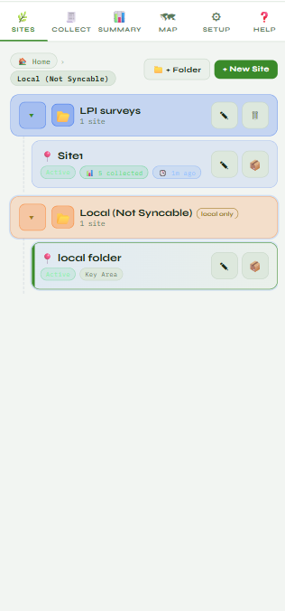
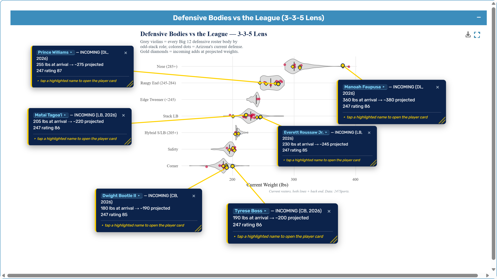
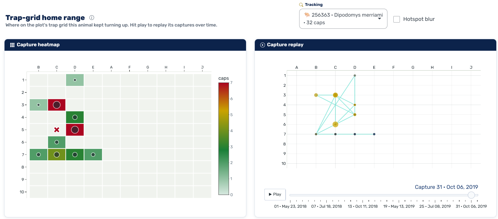
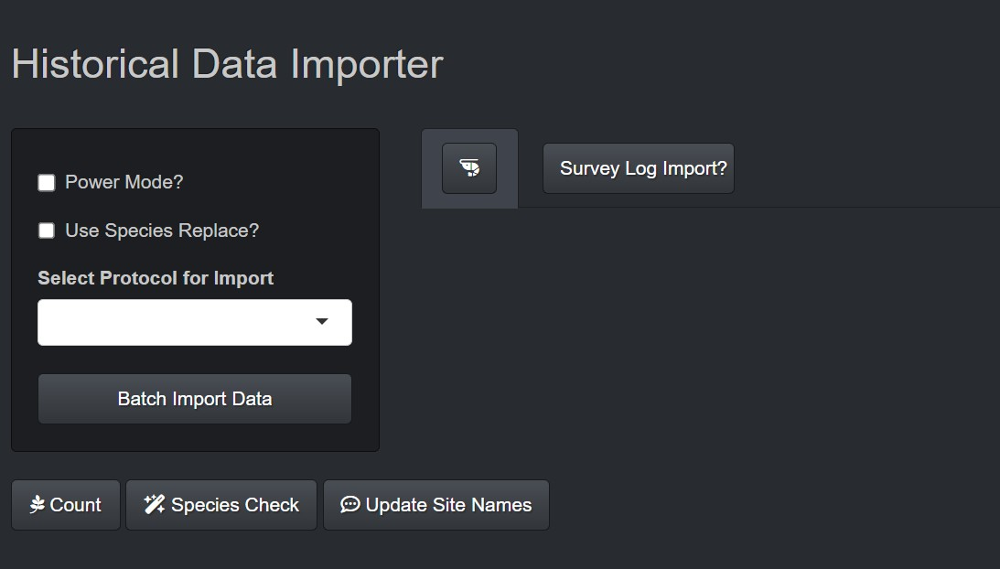
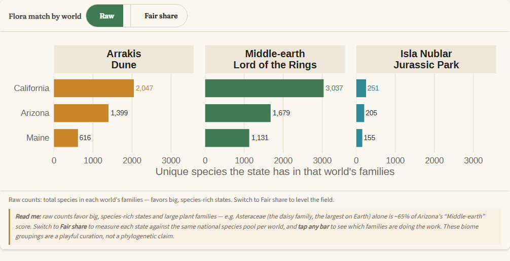
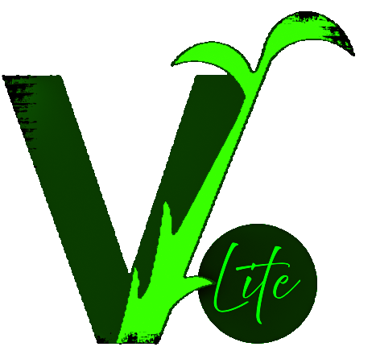
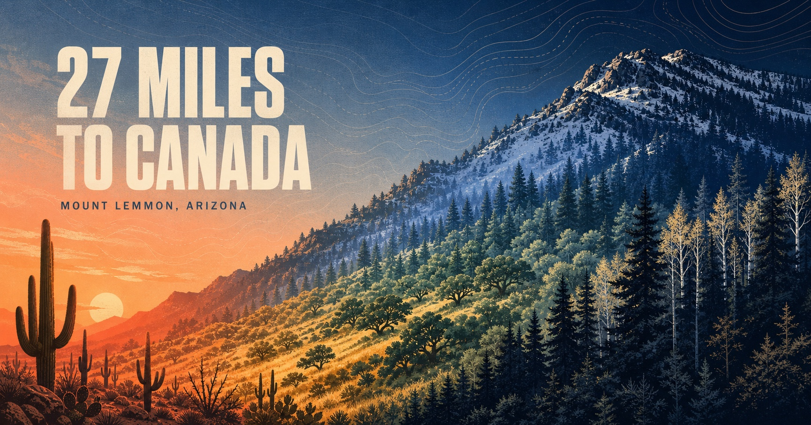
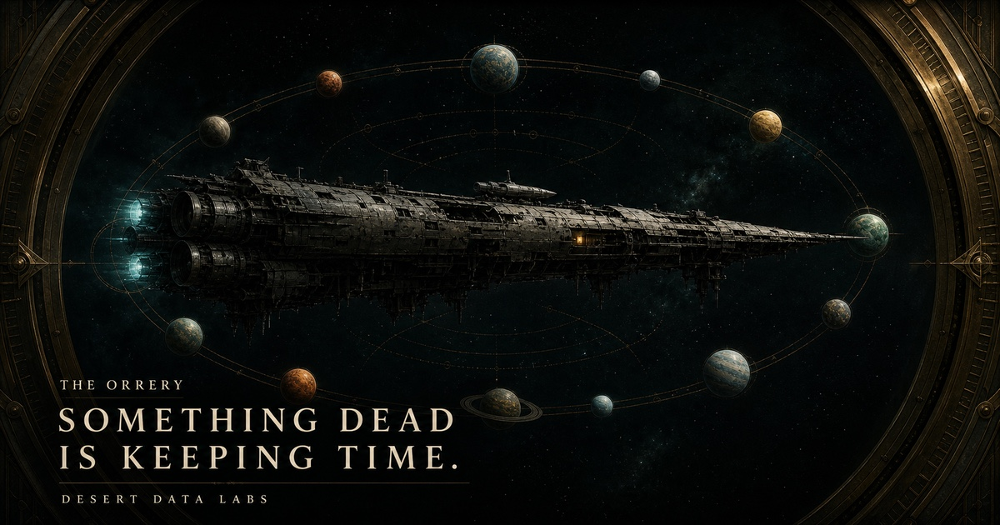

```{=html}
<div class="work-page">
  <header class="work-hero">
    <p class="signal-label"><span></span> Selected work</p>
    <h1>Data products, field tools, and <em>interactive websites.</em></h1>
    <p>Selected projects across ecology, operations, sports analytics, and creative web development.</p>
    <div class="portfolio-actions"><a class="tg-btn tg-btn-primary" href="#work-grid">Browse projects ↓</a><a class="tg-btn tg-btn-ghost" href="resume.qmd">View résumé</a></div>
  </header>

  <section class="work-collection" id="work-grid" aria-label="Project collection">
    <article class="work-item work-item--wide reveal">
      <div class="work-item__image"></div>
      <div class="work-item__body"><p>01 · Flagship platform</p><h2>EcoPlot Mobile</h2><h3>Offline ecological collection → cloud sync → office review → reporting.</h3><p>I architect and build this progressive web app for Desert Data Labs. It supports standardized and custom protocols, on-device storage, concurrent-edit detection, GPS, photos, maps, and an Azure-backed office workflow.</p><ul class="tech-list"><li>PWA</li><li>Azure SQL</li><li>Offline sync</li><li>Product design</li></ul><div class="case-links"><a href="ecoplot.qmd">Read case study →</a><a href="https://app.desertdatacollection.com/" target="_blank" rel="noopener">Open live app ↗</a></div></div>
    </article>

    <article class="work-item reveal">
      <div class="work-item__image"></div>
      <div class="work-item__body"><p>02 · Sports data product</p><h2>Big 12 Girth Index</h2><h3>Recruiting data becomes a visual scouting lab.</h3><p>Scraped rosters, ratings, measurements, records, and SP+ feed body maps, position distributions, role projections, and coaching-era comparisons across the conference.</p><ul class="tech-list"><li>R Shiny</li><li>Scraping</li><li>Plotly</li><li>Data modeling</li></ul><div class="case-links"><a href="https://girthindex.desertdatalab.com/" target="_blank" rel="noopener">Open live app ↗</a></div></div>
    </article>

    <article class="work-item reveal">
      <div class="work-item__image"></div>
      <div class="work-item__body"><p>03 · Ecological analytics</p><h2>NEON Small Mammal Tracker</h2><h3>National monitoring records, made personal and explorable.</h3><p>Site maps, individual capture histories, home-range heatmaps, diversity profiles, detection-corrected abundance, and transparent method notes turn a large public dataset into a useful field guide.</p><ul class="tech-list"><li>R</li><li>Ecological stats</li><li>Mapping</li><li>UX</li></ul><div class="case-links"><a href="https://tgilbert14.github.io/NEON-Small-Mammal-Tracker-App/" target="_blank" rel="noopener">Open project ↗</a></div></div>
    </article>

    <article class="work-item reveal">
      <div class="work-item__image"></div>
      <div class="work-item__body"><p>04 · ETL + QA/QC</p><h2>VGS Batch Importer</h2><h3>Historical spreadsheets become structured, checked field records.</h3><p>An R pipeline parses multiple vegetation protocols, resolves metadata, flags data-quality problems, and loads clean records into a local SQLite field database.</p><ul class="tech-list"><li>R</li><li>SQLite</li><li>Excel</li><li>QA/QC</li></ul><div class="case-links"><a href="projects.qmd">See implementation details →</a></div></div>
    </article>

    <article class="work-item reveal">
      <div class="work-item__image"></div>
      <div class="work-item__body"><p>05 · Data storytelling</p><h2>Plants in Movies</h2><h3>Which U.S. flora best matches three imagined worlds?</h3><p>A size-adjusted botanical comparison of Arrakis, Middle-earth, and Isla Nublar, built from roughly 250,000 USDA PLANTS records and compressed into a fast interactive experience.</p><ul class="tech-list"><li>R Shiny</li><li>USDA data</li><li>Visualization</li><li>Storytelling</li></ul><div class="case-links"><a href="https://tgilbert14.github.io/PlantsInMovies/" target="_blank" rel="noopener">Open project ↗</a></div></div>
    </article>

    <article class="work-item reveal">
      <div class="work-item__image"></div>
      <div class="work-item__body"><p>06 · Desktop utility</p><h2>VGSLite</h2><h3>Practical database maintenance without asking users to write SQL.</h3><p>An Electron-packaged R helper for repairing links, moving events, clearing deletion caches, converting databases, and reducing common support work in VGS 5 Desktop.</p><ul class="tech-list"><li>R</li><li>Electron</li><li>SQLite</li><li>Windows</li></ul><div class="case-links"><a href="projects.qmd">See features →</a></div></div>
    </article>
  </section>

  <section class="web-showcase portfolio-section" aria-labelledby="web-showcase-title">
    <div class="section-heading reveal">
      <div><p class="signal-label"><span></span> Interactive web</p><h2 id="web-showcase-title">Three browser-based experiments.</h2></div>
      <p>Framework-free sites built around procedural graphics, scrolling, sound, performance, and accessible fallbacks.</p>
    </div>
    <div class="web-project-grid">
      <a class="web-project reveal" href="https://tgilbert14.github.io/old-pueblo/" target="_blank" rel="noopener"><div class="web-project__image"><span>Scroll + sound</span></div><div class="web-project__copy"><p>The Long Saturday</p><h3>One desert day, from first light to kickoff.</h3><small>Canvas film scrubber · field-recorded soundscape · four scroll movements</small><b>Open site ↗</b></div></a>
      <a class="web-project reveal" href="https://tgilbert14.github.io/ddl-27-miles/" target="_blank" rel="noopener"><div class="web-project__image"><span>Procedural Canvas</span></div><div class="web-project__copy"><p>27 Miles to Canada</p><h3>A mile-by-mile climb from desert to mixed-conifer forest.</h3><small>Six biotic communities · elevation profile · modeled temperature</small><b>Open site ↗</b></div></a>
      <a class="web-project reveal" href="https://tgilbert14.github.io/ddl-orrery/" target="_blank" rel="noopener"><div class="web-project__image"><span>Procedural world</span></div><div class="web-project__copy"><p>The Orrery</p><h3>Eleven worlds, one shared clock, and a derelict ship.</h3><small>Canvas-baked scenes · generative audio · persistent survey state</small><b>Open site ↗</b></div></a>
    </div>
  </section>

  <section class="work-more reveal">
    <div><p class="signal-label"><span></span> More work</p><h2>Additional projects and archives.</h2></div>
    <div><a href="dashboards.qmd">Browse Shiny applications →</a><a href="projects.qmd">Browse utilities and analyses →</a><a href="field-notes.qmd">Browse the field archive →</a></div>
  </section>
</div>
```
