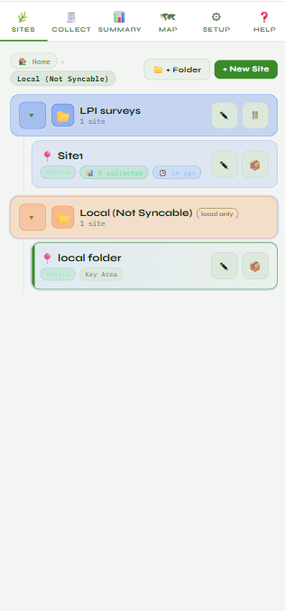
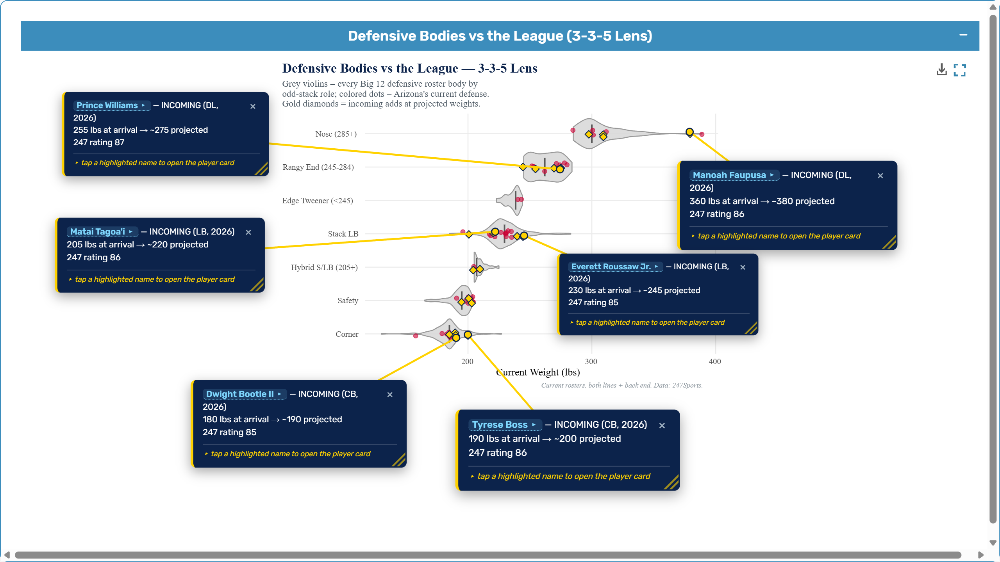
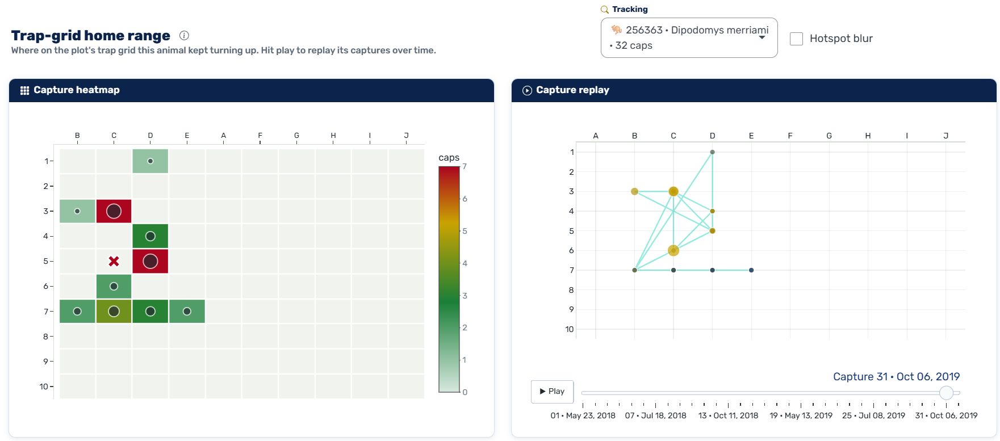
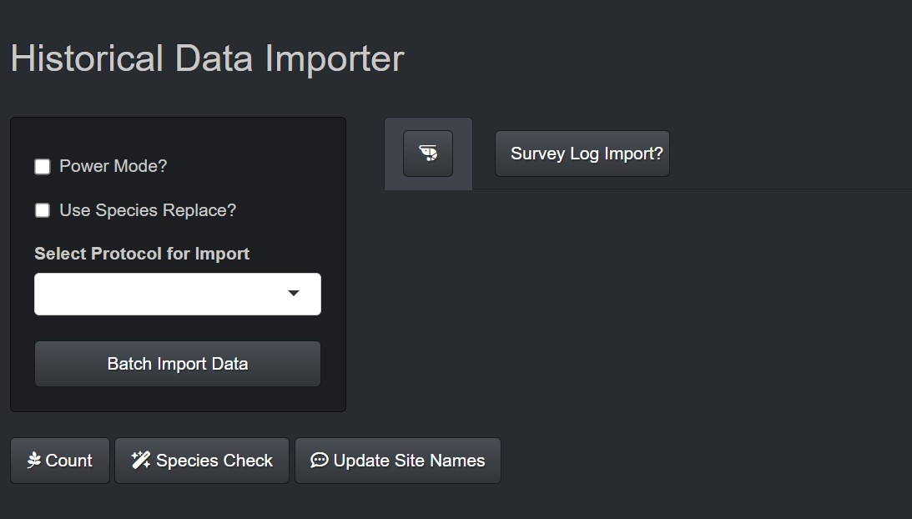
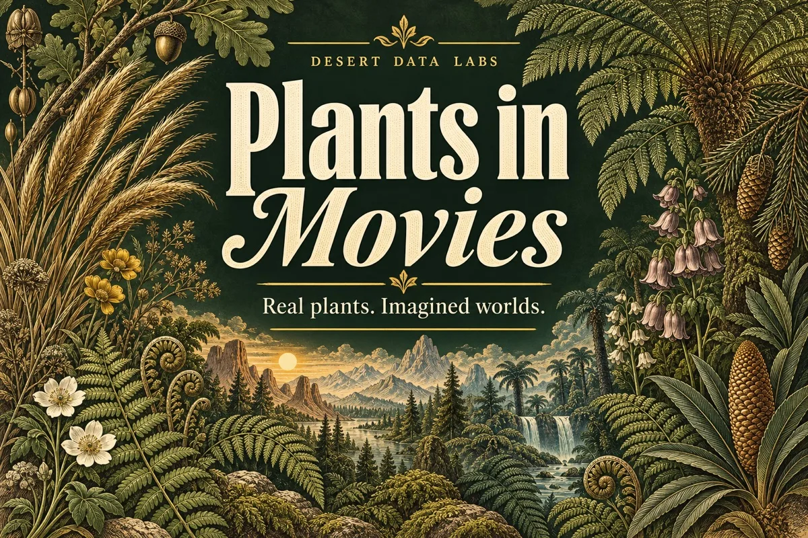
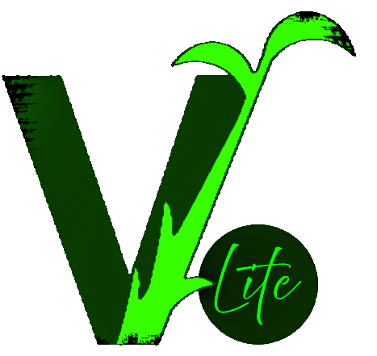
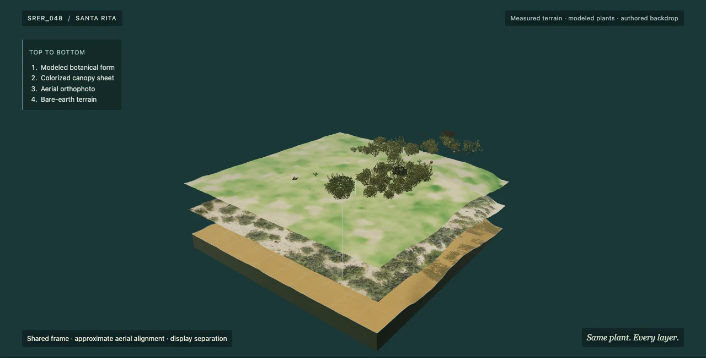
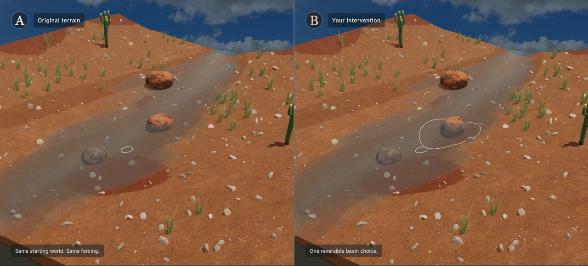
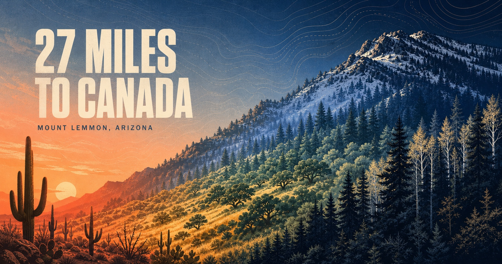
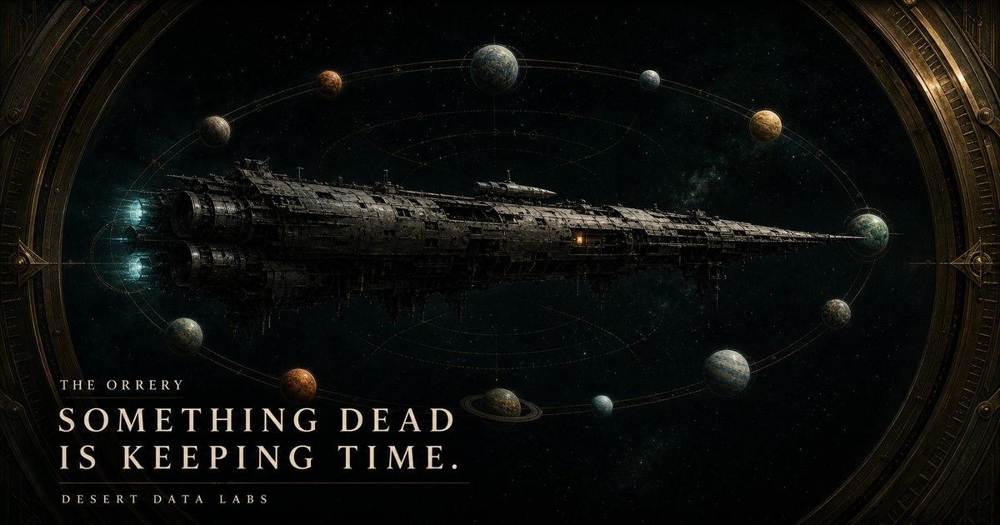

```{=html}
<div class="work-page">
  <header class="work-hero">
    <p class="signal-label"><span></span> Selected work</p>
    <h1>Data products, field tools, and <em>interactive websites.</em></h1>
    <p>From the offline field platform I build for Desert Data Labs to an app that works out which state has the flora of Arrakis.</p>
    <div class="portfolio-actions"><a class="tg-btn tg-btn-primary" href="#work-grid">Browse projects ↓</a><a class="tg-btn tg-btn-ghost" href="resume.qmd">View résumé</a></div>
  </header>

  <section class="work-collection" id="work-grid" aria-label="Project collection">
    <article class="work-item work-item--wide reveal">
      <div class="work-item__image"></div>
      <div class="work-item__body"><p>01 · Flagship platform</p><h2>EcoPlot Mobile</h2><h3>Offline ecological collection → cloud sync → office review → reporting.</h3><p>I architect and build this progressive web app for Desert Data Labs. It runs standardized and custom protocols, stores photos, GPS, and maps on the device, and detects concurrent edits when the crew syncs into an Azure-backed office workflow.</p><ul class="tech-list"><li>PWA</li><li>Azure SQL</li><li>Offline sync</li><li>Product design</li></ul><div class="case-links"><a href="ecoplot.qmd">Read case study →</a><a href="https://app.desertdatacollection.com/" target="_blank" rel="noopener">Open live app ↗</a></div></div>
    </article>

    <article class="work-item reveal">
      <div class="work-item__image"></div>
      <div class="work-item__body"><p>02 · Sports data product</p><h2>Power-4 Girth Index</h2><h3>Every roster, by size, by position, and by where the talent came from.</h3><p>A transparent dashboard shows data freshness and coverage before body maps, position profiles, Program Reach, and Talent Origins explain how rosters are built across all 67 ACC, Big Ten, Big 12, and SEC programs. Direct Matchups can pair any two schools; for football, Talent vs Results and Wins Above Talent show whether recruiting turns into wins.</p><ul class="tech-list"><li>R Shiny</li><li>Data pipelines</li><li>Plotly</li><li>Geospatial analysis</li></ul><div class="case-links"><a href="https://girthindex.desertdatalab.com/" target="_blank" rel="noopener">Open live app ↗</a></div></div>
    </article>

    <article class="work-item reveal">
      <div class="work-item__image"></div>
      <div class="work-item__body"><p>03 · Ecological analytics</p><h2>NEON Small Mammal Tracker</h2><h3>Pick one of 46 NEON field sites and meet everything trapped there.</h3><p>Site maps, individual capture histories, home-range heatmaps, diversity profiles, detection-corrected abundance, and transparent method notes turn a large public dataset into a useful field guide.</p><ul class="tech-list"><li>R</li><li>Ecological stats</li><li>Mapping</li><li>UX</li></ul><div class="case-links"><a href="https://tgilbert14.github.io/NEON-Small-Mammal-Tracker-App/" target="_blank" rel="noopener">Open project ↗</a></div></div>
    </article>

    <article class="work-item reveal">
      <div class="work-item__image"></div>
      <div class="work-item__body"><p>04 · ETL + QA/QC</p><h2>VGS Batch Importer</h2><h3>Historical Excel datasheets in, and the corrupt rows stay out.</h3><p>An R pipeline parses multiple vegetation protocols, resolves metadata, flags data-quality problems, and loads clean records into a local SQLite field database.</p><ul class="tech-list"><li>R</li><li>SQLite</li><li>Excel</li><li>QA/QC</li></ul><div class="case-links"><a href="projects.qmd">See implementation details →</a></div></div>
    </article>

    <article class="work-item reveal">
      <div class="work-item__image"></div>
      <div class="work-item__body"><p>05 · Data storytelling</p><h2>Plants in Movies</h2><h3>Movie worlds, explored through real plant records.</h3><p>An illustrated botanical atlas for Arrakis, Middle-earth and Isla Nublar. Compare states, see which families contribute to each match, explore the artwork with a specimen lens, and download saved comparisons from your field notebook.</p><ul class="tech-list"><li>R Shiny</li><li>USDA data</li><li>Visualization</li><li>Storytelling</li></ul><div class="case-links"><a href="https://019ecc91-3c6c-bee2-f824-0ea23fc60ac6.share.connect.posit.cloud/" target="_blank" rel="noopener">Open project ↗</a></div></div>
    </article>

    <article class="work-item reveal">
      <div class="work-item__image"></div>
      <div class="work-item__body"><p>06 · Desktop utility</p><h2>VGSLite</h2><h3>Practical database maintenance without asking users to write SQL.</h3><p>An Electron-packaged R helper for repairing links, moving events, clearing deletion caches, converting databases, and reducing common support work in VGS 5 Desktop.</p><ul class="tech-list"><li>R</li><li>Electron</li><li>SQLite</li><li>Windows</li></ul><div class="case-links"><a href="projects.qmd">See features →</a></div></div>
    </article>
  </section>

  <section class="web-showcase portfolio-section" aria-labelledby="web-showcase-title">
    <div class="section-heading reveal">
      <div><p class="signal-label"><span></span> Interactive web</p><h2 id="web-showcase-title">Explore the records. Compare the model.</h2></div>
      <p>Field records and a paired storm model, alongside experiments in film, elevation, and procedural worlds.</p>
    </div>
    <div class="web-project-grid web-project-grid--experiences">
      <a class="web-project web-project--study reveal" href="https://desertdatalabs.com/experiences/living-x-ray/" target="_blank" rel="noopener">
        <div class="web-project__image"></div>
        <div class="web-project__copy"><p>Living X-Ray · NEON field records</p><h3>How do the plant records fit the ground?</h3><p class="web-project__note">I brought native Santa Rita terrain, aerial imagery, a canopy layer, and 179 tagged records into one scene. Peel the layers and select a specimen; its receipt shows source measurements, date limits, and model defaults.</p><small>Three.js · native 1 m terrain · modeled botanical forms</small><b>Inspect the plot ↗</b></div>
      </a>
      <a class="web-project web-project--study reveal" href="https://desertdatalabs.com/experiences/two-futures/" target="_blank" rel="noopener">
        <div class="web-project__image"></div>
        <div class="web-project__copy"><p>Two Futures · Storm Table model</p><h3>Hold the storm fixed. Change one basin.</h3><p class="web-project__note">I paired two independent Storm Table simulations under the same storm, camera, and replay clock. Add one basin in B, inspect the first sustained depth change beyond the cut, and save the model ledgers and recipe.</p><small>Time-compressed, uncalibrated exhibit. Not a site forecast.</small><b>Run the comparison ↗</b></div>
      </a>
      <a class="web-project reveal" href="https://tgilbert14.github.io/old-pueblo/" target="_blank" rel="noopener"><div class="web-project__image"><span>Scroll + sound</span></div><div class="web-project__copy"><p>The Long Saturday</p><h3>One desert day, from first light to kickoff.</h3><small>Canvas film scrubber · field-recorded soundscape · four scroll movements</small><b>Open site ↗</b></div></a>
      <a class="web-project reveal" href="https://tgilbert14.github.io/ddl-27-miles/" target="_blank" rel="noopener"><div class="web-project__image"><span>Procedural Canvas</span></div><div class="web-project__copy"><p>27 Miles to Canada</p><h3>Drive from saguaros to snow in twenty-seven miles.</h3><small>Six biotic communities · elevation profile · modeled temperature</small><b>Open site ↗</b></div></a>
      <a class="web-project reveal" href="https://tgilbert14.github.io/ddl-orrery/" target="_blank" rel="noopener"><div class="web-project__image"><span>Procedural world</span></div><div class="web-project__copy"><p>The Orrery</p><h3>Eleven worlds, one shared clock, and a derelict ship.</h3><small>Canvas-baked scenes · generative audio · persistent survey state</small><b>Open site ↗</b></div></a>
    </div>
    <article class="demolition-console reveal" aria-labelledby="demolition-title" data-demolition-console>
      <button class="demolition-target" type="button" disabled aria-label="Miniature target illustration" data-demolition-test>
        <span class="demolition-target__label">Miniature target</span>
        <svg viewBox="0 0 300 184" fill="none" aria-hidden="true">
          <defs><pattern id="demolition-grid" width="20" height="20" patternUnits="userSpaceOnUse"><path d="M20 0H0V20" stroke="currentColor" stroke-opacity=".13"/></pattern></defs>
          <path fill="url(#demolition-grid)" d="M0 0h300v184H0z"/>
          <g class="demolition-target__page">
            <path d="m65 40 147-13 24 113-147 13z" fill="currentColor" fill-opacity=".07" stroke="currentColor" stroke-opacity=".55"/>
            <path d="m65 40 147-13 4 18-147 13z" fill="currentColor" fill-opacity=".13"/>
            <path d="m80 44 3-.3m6-.5 3-.3m6-.5 3-.3M80 76l67-6m-65 17 47-4" stroke="currentColor" stroke-width="3" stroke-linecap="round"/>
            <path d="m85 104 40-4 6 29-40 4zm51-5 40-4 6 29-40 4zm51-4 24-2 6 29-24 2z" fill="currentColor" fill-opacity=".16"/>
            <path d="m162 66 42-4 3 17-42 4z" fill="currentColor" fill-opacity=".25"/>
          </g>
          <g class="demolition-target__sight"><circle cx="150" cy="91" r="36" stroke="currentColor" stroke-width="1.2"/><path d="M150 42v23m0 52v23M101 91h23m52 0h23" stroke="currentColor" stroke-width="1.5"/><circle cx="150" cy="91" r="3" fill="currentColor"/></g>
          <g class="demolition-target__hit"><circle cx="150" cy="91" r="13" stroke="currentColor" stroke-width="2"/><path d="m125 74-9-8m60 12 10-5m-36-18v-9m-18 67-6 9m40-8 5 9" stroke="currentColor" stroke-width="2" stroke-linecap="round"/></g>
          <path d="M18 44V18h26m212 0h26v26M18 140v26h26m212 0h26v-26" stroke="currentColor" stroke-opacity=".35"/>
        </svg>
        <span class="demolition-target__caption"><span data-demolition-test-label>Preview only</span><span aria-hidden="true">＋</span></span>
      </button>
      <div class="demolition-copy">
        <p class="demolition-kicker">One more way to explore</p>
        <h3 id="demolition-title">Take a shot at my portfolio.</h3>
        <p>Play with a copy of this page in Sprite Fusion.</p>
        <small>A game by Hugo Duprez / <a href="https://www.spritefusion.com/games/destroy-any-website" target="_blank" rel="noopener noreferrer">Sprite Fusion ↗</a></small>
      </div>
      <div class="demolition-launch-panel">
        <a class="demolition-launch" href="https://destroy.spritefusion.com/?from=badge&amp;url=https%3A%2F%2Ftgilbert14.github.io%2Ftimothy-gilbert-portfolio%2F" target="_blank" rel="noopener noreferrer" aria-label="Launch Destroy Any Website on Sprite Fusion in a new tab" data-demolition-launch><span>Launch game <span aria-hidden="true">↗</span></span></a>
        <p>Mouse or touch to aim.<br>Phone: landscape. Esc pauses.</p>
      </div>
    </article>
  </section>

  <section class="work-more reveal">
    <div><p class="signal-label"><span></span> More work</p><h2>More Shiny apps, more utilities, and a wall of 90 plant photos.</h2></div>
    <div><a href="dashboards.qmd">Browse Shiny applications →</a><a href="projects.qmd">Browse utilities and analyses →</a><a href="field-notes.qmd">Browse the field archive →</a></div>
  </section>
</div>
<script src="assets/creative/demolition-launcher.js" defer></script>
```
